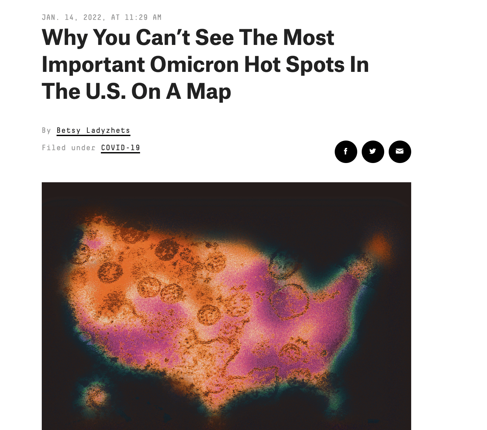
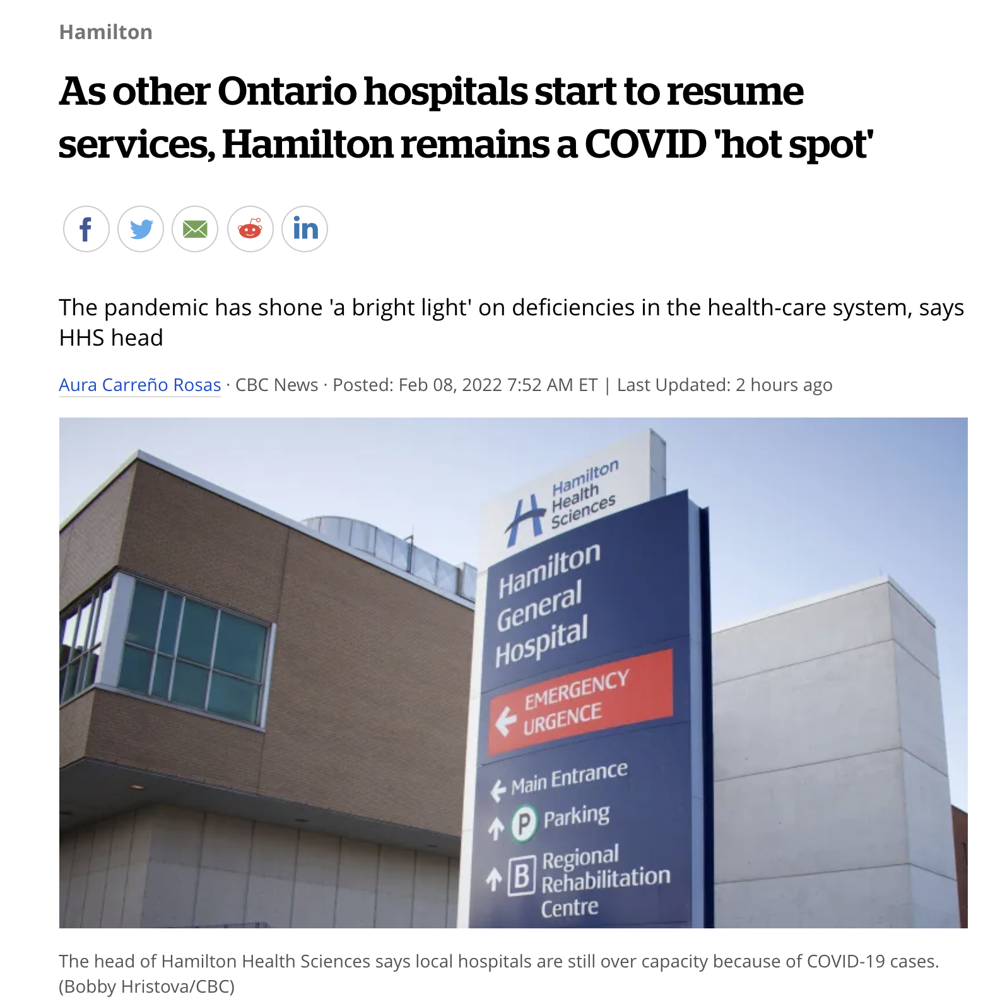
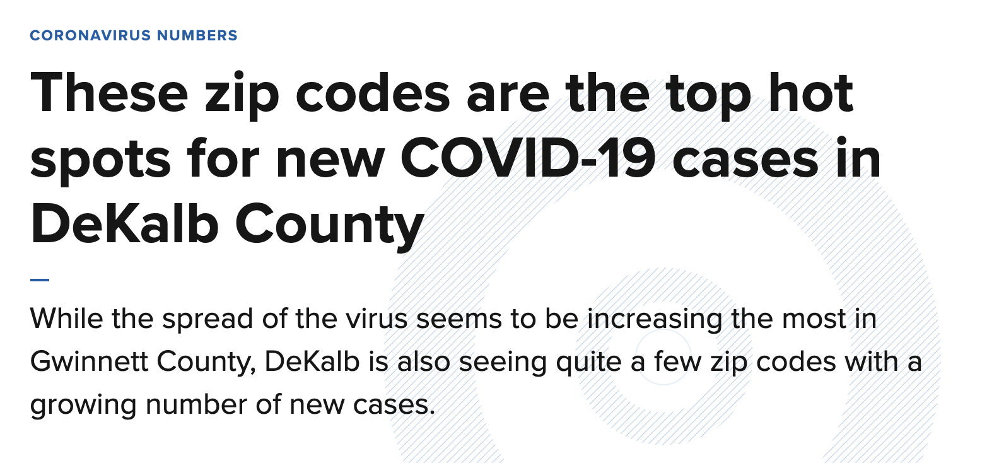
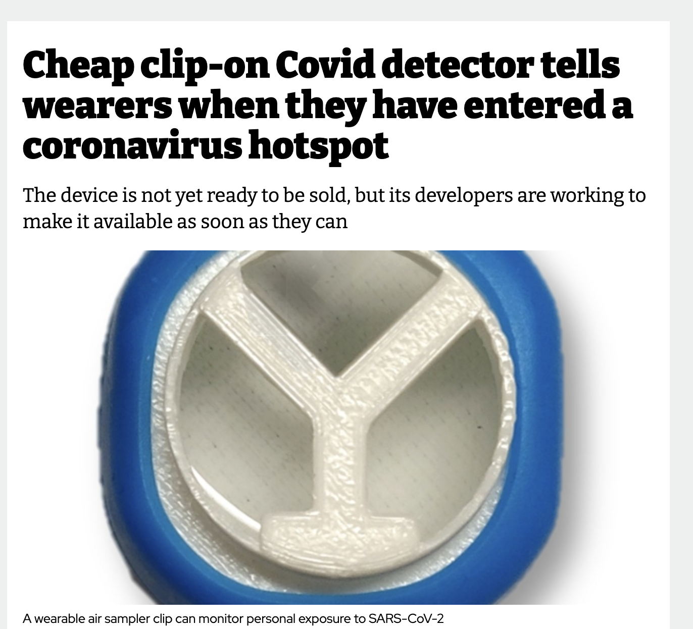

```{r setup, echo=FALSE,warning=FALSE,message=FALSE}
knitr::opts_knit$set(root.dir = rprojroot::find_root(".git/index"))

## This function uses the `here` package to make it easy to include graphics in a directory
## relative to the project root
include_local_graphics <- function(x) {
  knitr::include_graphics(here::here(x))
}
```

# What is clustering, anyway? {#title}

<div class="paddeddiv">
  <p style="font-size:0.5em; text-align: left;">
      EPID 684  
      Spatial Epidemiology  
      2/8/2022 
      <br><br>
      Jon Zelner  
      `jzelner@umich.edu`  
      [`epibayes.io`](https://epibayes.io) 
    </p>
</div>

<div class="itemr" id="footerDiv"></div>

# The <span style="color: #aad4e5">February</span> Slump {.imgslide}


The struggle is real. 🥶

# Agenda

>- What is <span class="alert">clustering</span>?
>- What is a <span style="color: red">hotspot</span> 🔥, anyway?.
>- Interrogating the hotspot and cluster ideas with respect to your projects.

# <span class="alert">Why</span> might one undertake a cluster-based study?

>- Public Health Response.
>- Hypothesis testing.
>- Identifying key <span class="alert">causal mechansisms</span>.

# Reasoning about clusters is <span class="alert">tricky</span> {.imgslide}


The Texas Sharpshooter 🎯 Problem is an example of a <span class="alert">logical fallacy</span> that can come up in the analysis of spatial clusters.

# What is a <span style="color: red">hotspot</span>? {.imgslide}

<div class="r-stack">
  
  
  
  
  </div>

  <span class="fragment">A hotspot is often in the eye of the beholder...</span>


# More detail is necessary to make the hotspot concept useful

> We recommend that the meaning of a “hotspot” be made *explicit* by use of an appropriate modifier such as: “burden hotspot,” to denote areas of elevated disease prevalence or incidence; “transmission” or “risk hotspot,” to denote areas of elevated transmission efficiency or a higher risk of disease acquisition; and “emergence hotspot,” to denote areas with an increased probability of disease emergence or reemergence. (Lessler et al., 2017)

# A cluster can represent multiple facets 💎 of risk

>- Spatial aggregation of a disease <span class="alert">outcome</span>.
>- Clustering of a specific <span class="alert">exposure risk</span>.
>- Evidence of <span class="alert">social processes</span> that concentrate disadvantage and multiple risks.

# Our Turn!

Relate the hotspot/clustering metaphors to your <span class="alert">project topic area</span> with respect to:

1.  [Public Health Response](https://miro.com/app/board/uXjVOOuiZ_w=/?moveToWidget=3458764518440056419&cot=14)

2. [Applied and Academic Research](https://miro.com/app/board/uXjVOOuiZ_w=/?moveToWidget=3458764518440374406&cot=14)

3. [Potential Pitfalls](https://miro.com/app/board/uXjVOOuiZ_w=/?moveToWidget=3458764518440723984&cot=14)

# Next Time {.imgslide}


[Residential Segregation as a Fundamental Cause of Health Inequality](https://publish.obsidian.md/epibayes/Courses/EPID684/modules/Module+3/Sessions/3.+Residential+Segregation+and+the+Social+Drivers+of+Clustered+Risk)

<!-- 


Defining spatial <span class="alert">weights</span> and who is <span class="alert">neighbors</span> with who is key to measuring clustering. -->