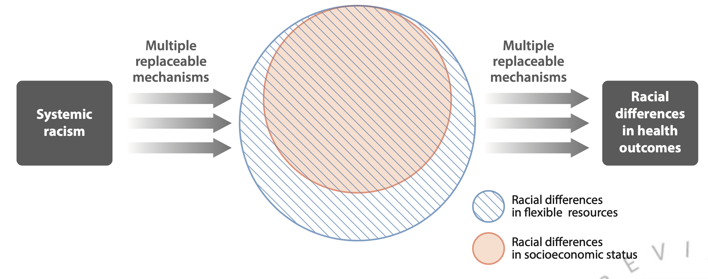
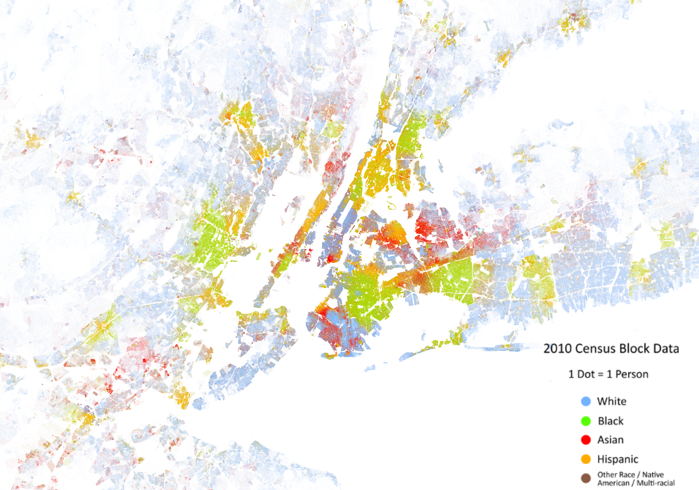
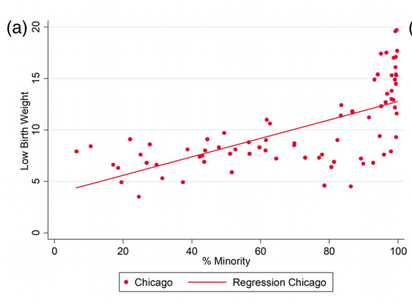
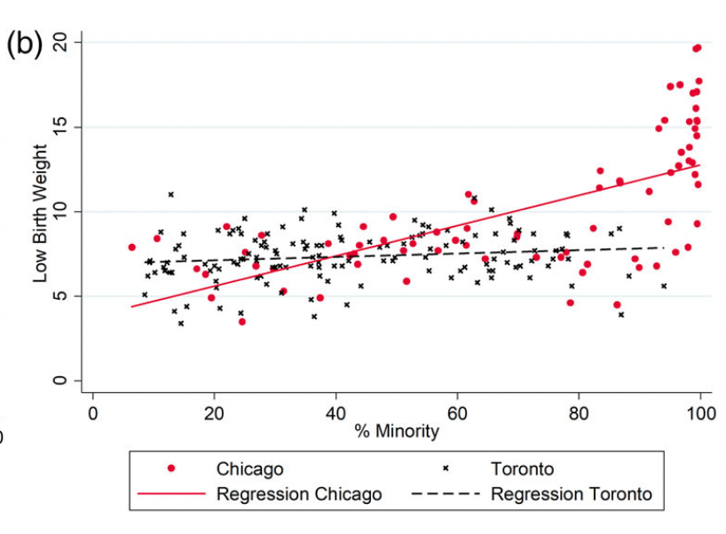
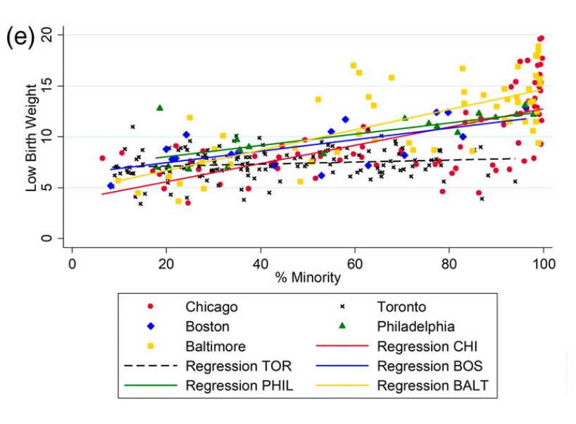
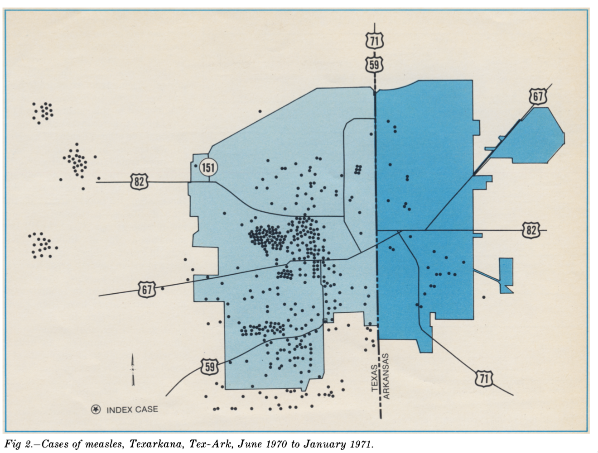

```{r setup, echo=FALSE,warning=FALSE,message=FALSE}
knitr::opts_knit$set(root.dir = rprojroot::find_root(".git/index"))

## This function uses the `here` package to make it easy to include graphics in a directory
## relative to the project root
include_local_graphics <- function(x) {
  knitr::include_graphics(here::here(x))
}
```

# Getting at the <span class="alert">fundamental causes</span> of spatial health inequality {#title}

<div class="paddeddiv">
  <p style="font-size:0.5em; text-align: left;">
      EPID 684  
      Spatial Epidemiology  
      2/10/2022 
      <br><br>
      Jon Zelner  
      `jzelner@umich.edu`  
      [`epibayes.io`](https://epibayes.io) 
    </p>
</div>

<div class="itemr" id="footerDiv"></div>


# Agenda

>- Wrap up clustering mind-mapping exercise from Monday.
>- What is the <span class="alert">fundamental cause</span> perspective and how does it relate to spatial epidemiology?
>- Between-city and cross-national comparison of the impact of segregation on low birthweight.
>- How can we measure <span class="alert">spatial segregation</span>?


# Speaking of <span class="alert">fallacies...

  <blockquote class="twitter-tweet tw-align-center"><p lang="en" dir="ltr">time for a dag <a href="https://t.co/1iruI4Xzkr">https://t.co/1iruI4Xzkr</a> <a href="https://t.co/EEILMYmU5L">pic.twitter.com/EEILMYmU5L</a></p>&mdash; Andrew Heiss (@andrewheiss) <a href="https://twitter.com/andrewheiss/status/1491511076906745861?ref_src=twsrc%5Etfw">February 9, 2022</a></blockquote> 
  
  <script async src="https://platform.twitter.com/widgets.js" charset="utf-8"></script>

# Clustering 🧠 🗺️ Wrap-up

1.  [Public Health Response](https://miro.com/app/board/uXjVOOuiZ_w=/?moveToWidget=3458764518440056419&cot=14)

2. [Applied and Academic Research](https://miro.com/app/board/uXjVOOuiZ_w=/?moveToWidget=3458764518440374406&cot=14)

3. [Potential Pitfalls](https://miro.com/app/board/uXjVOOuiZ_w=/?moveToWidget=3458764518440723984&cot=14)

# What is the <span class="alert">fundamental cause</span> approach?

>- Theoretical perspective on the generation of health inequalities as a function of high-level risks like <span class="alert">socioeconomic status</span> (SES) as well as racial discrimination, social stigma, and residential segregation.

>- Focuses on how upstream determinants put individuals <span class="alert">at risk of risks</span>.

>- Important for understanding spatially <span class="alert">clustered</span> health outcomes and inequalities. 

# What makes SES a fundamental cause?

>- Reflects differential access to <span style="color: green;">money</span>, information and social <span class="alert">power</span>.
>- Impacts <span class="alert">multiple</span> more-proximal risks for disease.
>- Likely to drive risk across <span class="alert">multiple</span> health outcomes.
>- Association persists even when a <span class="alert">proximal mechanism</span> is no longer associated with SES.

# Why is racism as a fundamental cause <span class="alert">in addition</span> to SES?  {.imgslide}

<div class="fragment">

Why can't <span class="alert">socioeconomic status</span> explain all of this association?</div>

# Racism has many impacts on health that <span class="alert">go beyond and modify</span> SES

>- Differential quality of medical treatment.

>- Differential access to health-promoting environments.

>- Employment and housing discrimination. 

>- Emotional and physical stress resulting from prolonged exposure to discrimination.

# Racial residential segregation reflects <span class="alert">spatial clustering of risk</span> caused by racism. {.imgslide}



What does segregation <span class="alert">do</span> in the generation of health inequalities?

# How does the impact of <span class="alert">segregation</span> on birth outcomes vary between cities and countries?

>- How do DeMaio et al. measure segregation in Toronto and Chicago? What do you think of this metric?
>- How does the impact of residential segregation on LBW vary between the U.S. cities and Toronto?
>-  What would you critique about this study and its conclusions?

# Relationships between community composition and LBW  {.imgslide}

<div class="r-stack">

</div>

# Cross-country differences not so different from this {.imgslide}



Measles cases in Texarkana, Tex and Texarkana, Ark in 1970

# How else could we conceptualize <span class="alert">segregation</span>?

<div class="fragment"><span class="alert">Isolation</span>: defined as the proportion of contacts an individual in a minority group in a population has with a member of that same group.</div>

# Sometimes paired with the <span class="alert">interaction</span> index

Interaction quantifies the proportion of minority group member's contacts that occur with the majority group.

# What are these indices used for? 

>- Quantify the *intensity* of contact between groups, e.g. as in residential segregation. 

>- Measure exposure of potentially infectious individuals to susceptible individuals.

>- Describe the distribution of plant species across a geographic area.

# How do you measure <span class="alert">isolation</span> ?

$$
Z = \sum_{i} \frac{a_{i}}{A} \frac{a_{i}}{n_i}
$$

Where:

- $a_i$: Number of minority  members in area $i$
- $b_i$: Number of majority group members in area $i$
- $A$ total number of minority group members
- $B$ total number of majority group members, where $A < B$.
- $n_i$ number individuals in area $i$, i.e. $a_i + b_i$

# How do you measure <span class="alert">interaction</span>?

$$
Z = \sum_{i} \frac{a_{i}}{A} \frac{b_{i}}{n_i}
$$

Where:

- $a_i$: Number of minority  members in area $i$
- $b_i$: Number of majority group members in area $i$
- $A$ total number of minority group members
- $B$ total number of majority group members, where $A < B$.
- $n_i$ number individuals in area $i$, i.e. $a_i + b_i$


# Reflects <span class="alert">qualitative</span> differences in contact {.imgslide}


As concentration of minority group increases, isolation does as well

# What happens when we induce more separation?


# Isolation is <span class="alert">density dependent</span> {.imgslide}


When individuals are randomly distributed, isolation equals the <span class="alert">minority share</span> of the population.

# <span style="color: red"> A problem:</span> Isolation ignores spatial structure


# <span class="alert">Randomizing</span> locations doesn't change isolation


# Is this really a good representation...


# Of this?


# A useful metric...with some drawbacks

>- Isolation tells us something that may be <span class="alert">qualitatively important</span>

>- A good fit for a range of epidemiological and social problems

>- Limited by lack of information about <span class="alert">spatial structure
</span>

>- Choice of <span class="alert">spatial units</span> is critical for interpretation

# Next Time 

Looking in more depth at the relationship between segregation and <span class="alert">communicable</span> and <span class="alert">non-communicable</span> diseases:

<div style="font-size: 0.5em;">[Biello KB, Kershaw T, Nelson R, Hogben M, Ickovics J, Niccolai L. Racial Residential Segregation and Rates of Gonorrhea in the United States, 2003–2007. _Am J Public Health_. 2012;102(7):1370-1377](https://www.dropbox.com/s/d7dd1tp5f8crzms/biello_et_al_2012_racial_residential_segregation_and_rates_of_gonorrhea_in_the_united_states%2C.pdf?dl=0). doi:[10.2105/AJPH.2011.300516](https://doi.org/10.2105/AJPH.2011.300516)

[Woo H, Brigham EP, Allbright K, et al. Racial Segregation and Respiratory Outcomes among Urban Black Residents with and at Risk of Chronic Obstructive Pulmonary Disease. _Am J Respir Crit Care Med_. 2021;204(5):536-545.](https://www.dropbox.com/s/lh1tbqc6qx4ewtz/woo_et_al_2021_racial_segregation_and_respiratory_outcomes_among_urban_black_residents_with.pdf?dl=0) doi:[10.1164/rccm.202009-3721OC](https://doi.org/10.1164/rccm.202009-3721OC)</div>

<!-- 


Defining spatial <span class="alert">weights</span> and who is <span class="alert">neighbors</span> with who is key to measuring clustering. -->