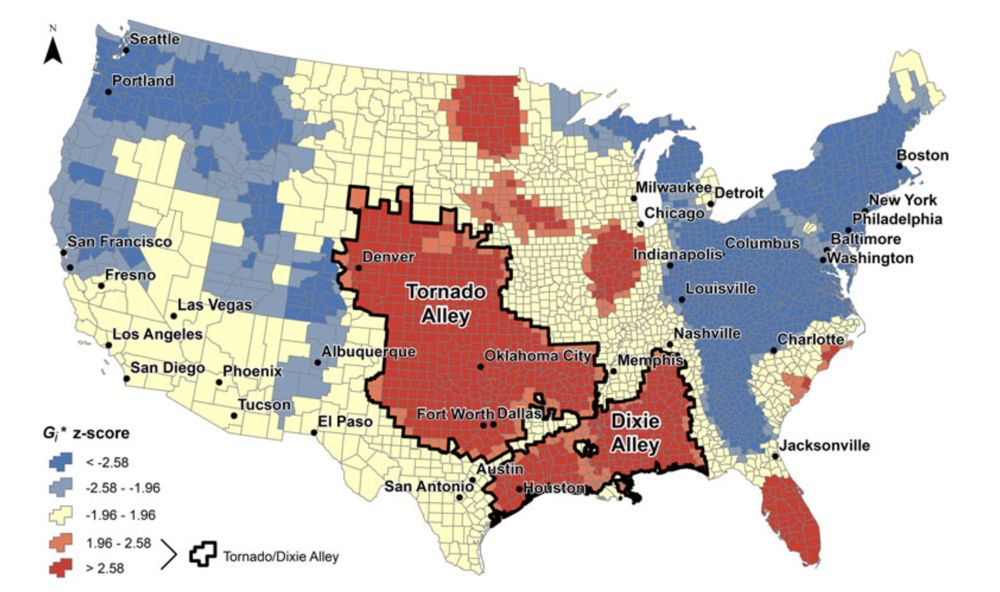

# Why theory is key to connecting structural racism to health outcomes {#title}

  

      EPID 684  
      Spatial Epidemiology  
      3/10/2022  
        
      Jon Zelner  
      `jzelner@umich.edu`  
      [`epibayes.io`](https://epibayes.io) 
    

# Today's Theme {.quoteslide}

How can we appropriately measure the impacts of structural racism on spatial health inequality?

# Agenda

>- Methodological considerations in the measurement of structural racism.

>- Measuring the impact of segregation over the lifecourse on CVD risk.

>- Mind-mapping of key concepts and outcomes re: segregation, structural racism, and health inequality wrt your final projects.

# Values and biases are baked into the ways we measure...everything. {.imgslide}

Suggestions for accurately measuring the nature of and impact of structural racism on health outcomes (From Adkins-Jackson et al., 2021)

# How does exposure to racial residential segregation impact cardiovascular disease (CVD) risk?

>- Kershaw et al. used longitudinal data from 2280 Black participants of a cohort study taking place in 4 cities. 

>- Neighborhood-level intensity of exposure to segregation was a key input to the model.

>- Variation in systolic blood pressure was used as an indicator of CVD risk.

# How might residential segregation impact CVD risk?

>- Stress

>- Access to medical care

>- Quality of overall physical environment.

>- Food access 

>- And on, and on...

# How can we measure individual-level exposure to segregation?

>- Measures like isolation, dissimilarity, centralization are all summaries of segregation or clustering in a given area.

>-  Statistics like the Getis-Ord $G_i^*$ allow us to capture local variation in exposure.

>- $G_i$ is the predecessor to $G_i^*$. Captures the same basic idea but is a bit more intutive.

>- Uses information on a location and its surrounding areas to estimate local intensity.

# Getis-Ord $G_i$ statistic

$$G_{i}(d)=\frac{\sum_{j}w_{ij}(d)x_j}{\sum_{j}x_j}$$

Where:

>- $d$ is the maximum distance to consider clustering 

>- $w_{ij}(d)=1$ if place $i$ and place $j$ are within $d$ of each other, and 0 otherwise. (When $i=j$, $w_{ij}=0$)

>- $x_j$ is the variable of interest

>- Yields an estimate of both strength of clustering and approximate statistical significance.

# Lets us go from this...

# To this...

# Long-term cohort design in Kershaw et al. allows study of within-person changes in exposure to segregation.

>- Allows adjustment for individual-level factors such as age, sex, physical activity, smoking, etc. 

>- Can measure changes in segregation intensity in neighborhood of origin and destination for people who have moved.

>- Have to be sure that people who moved are not systematically different from those who didn't.

# Higher intensity of segregation $\to$ higher blood pressure.
 
>- People who moved from a high- to lower-segregation context experienced small but meaningful decreases in blood pressure. 

>- Suggests that policies facilitating neighborhood mobility could have positive health effects.

>- Reliance on SBP as a proxy for CVD is a limitation, but a common one when the outcome is relatively rare and the effect is subtle - even if it is important.

# Doing better work on structural racism requires creativity 

> We must think beyond our training, statistical tests, and practices that dismiss methodologies that we may be unfamiliar with. There is scholarship being overlooked that proposes new approaches we could explore..., but we cannot move forward with capturing variables like structural racism if we do not explore our creativity. (From Adkins-Jackson 2021)

# Time to grapple with the complexity of social-spatial relationships in our own work

>- The spatial expression of social inequality is complex.

>- Our measures are necessarily reductive, and that's OK...

>- IF and only IF (⟺) we use these measures carefully without losing sight of the mechanisms and outcomes we care about.

>- Lets spend some time making sense of these ideas using [this Miro board](https://miro.com/app/board/uXjVOHe4agI=/?invite_link_id=546695231041).

# Next Time

[Relating the mechanisms of structural racism to infectious disease transmission.](https://publish.obsidian.md/epibayes/Courses/EPID684/modules/Module+3/Sessions/6.+Mechanistic+linkages+between+structural+racism+and+infectious+disease+transmission)
