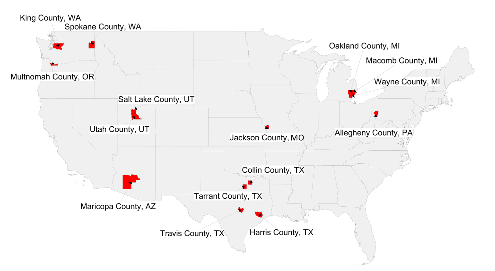
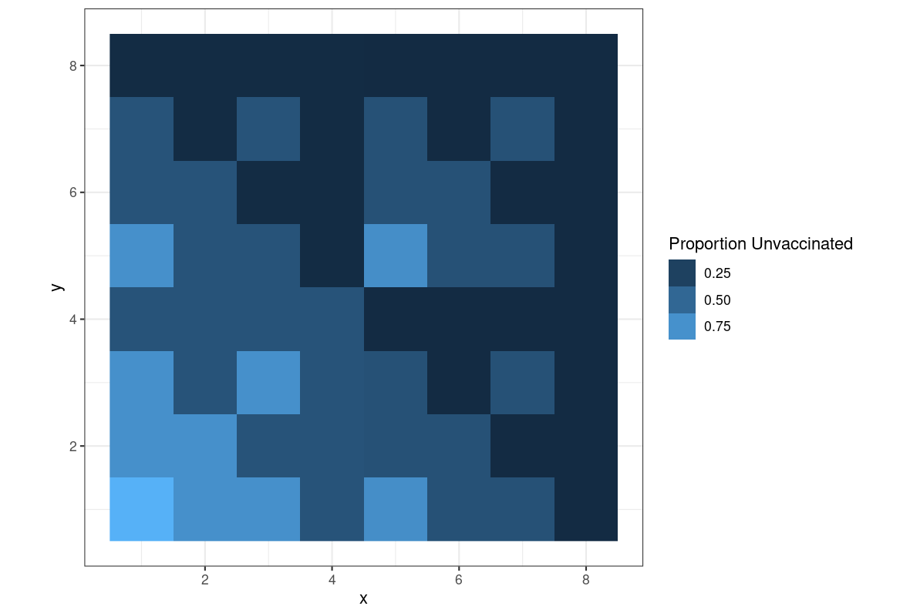
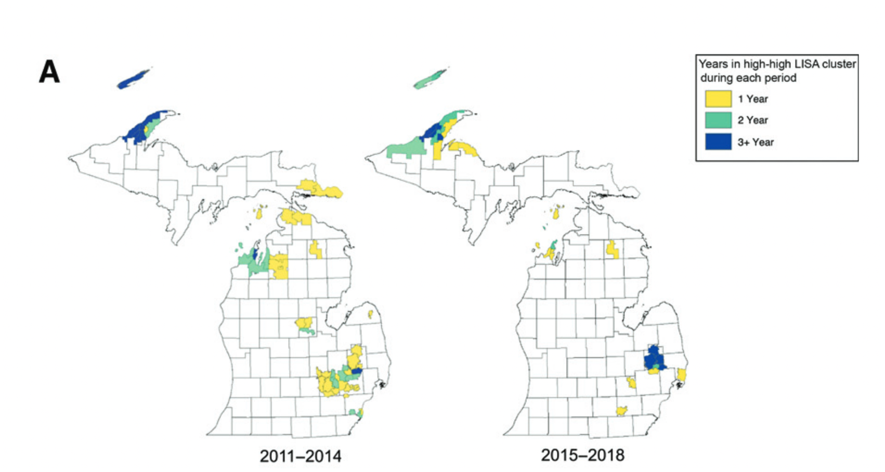
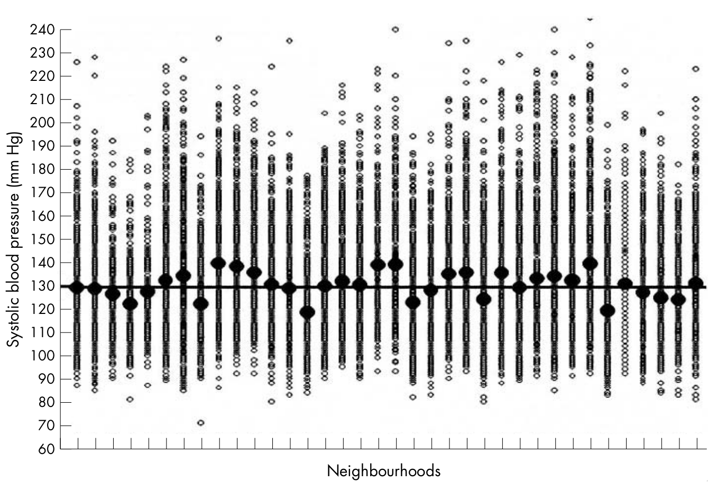

# Local spatial clustering of non-vaccination: Methodological and policy considerations {#title}

  

      EPID 684  
      Spatial Epidemiology  
      3/22/2022  
        
      Jon Zelner  
      `jzelner@umich.edu`  
      [`epibayes.io`](https://epibayes.io) 
    

# Today's Theme {.imgslide}

Measuring and understanding the public health implications of spatially clustered susceptibility through the lens of vaccine 💉 hesitancy.

# Agenda

>- Review of global Moran's I

>- Measuring spatial clustering with simulated data hands-on

>- Quick intro to local Moran's I

>- Discussion of Masters et al. paper on policy impacts on non-medical exemption rates and their clustering.

# Moran's I revisited

>- Negative values of *I* indicate that neighboring areas are more likely to be dissimilar to each other than non-neighboring ones.

>- Positive values indicate that neighboring values are more likely to be similar to each other. 

>- Can accomodate a range of ways of calculating values and distances, but here we'll stick to something simple.

# Really just a measure of correlation

Let's start with classic pearson correlation:

$$
r = \frac{\sum_{i} (x_i - \bar{x})(y_i - \bar{y})}{\sqrt{(x_i - \bar{x})^2} \sqrt{(y_i - \bar{y})^2}}
$$

Can be interpreted as the ratio of the covariance of x and y to the product of their standard deviations:
$$ 
r = \frac{\text{cov(x,y)}}{\sigma_x \sigma_y}
$$

# Moran's I translates from correlation between two variable to spatial autocorrelation

$$
I = \frac{N}{W} \frac{\sum_{i} \sum_{j} w_{ij} (x_i - \bar{x}) (x_j - \bar{x}) }{\sum_{i}(x_i - \bar{x})^2}
$$

Where:

>- N is the number of spatial areas & W is the sum of all the spatial \alert{weights}
>- $x_i$ and $x_j$ are the values of the i-th and j-th cells, $\bar{x}$ is the mean value of x across all squares
>- $w_{ij}$ indicates whether i & j are neighbors (yes = 1, no = 0 )
>- Only looking at neighbors: $w_{ij} = 0$ when $i = j$

# Moran's I translates from correlation between two variables to spatial autocorrelation in a single variable

$$
I = \frac{N}{W} \frac{\sum_{i}  \text{Covariance of x among neighbors of i} }{\text{Variance of x}}
$$

# Going hands-on {.imgslide}

Relating spatial heterogeneity in non-vaccination to [measures of global clustering](https://sph-umich.shinyapps.io/spatial_segregation)

# Some questions

1. Which level of clustering has the strongest impact on the clustering measures?

2. Which measure seems to be most sensitive to small changes in the probability of non-vaccination clustering?

3. How sensitive are the results for Moran's I to the choice of ♜'s vs. ♛'s contiguity?

# Does making non-medical exemptions harder to get impact their prevalence?

>- How would you describe the impact of the 2015 rules change on the trajectory of NMEs in Michigan?

>- What do we lean from looking at the spatial clustering of NMEs in Michigan before and after the policy change?

>- Does the spatial perspective in this piece add to the overall argument?

# \alert{LISA} statistics provide estimates of clustering at individual locations {.imgslide}

Local clustering of philosophical non-medical exemptions to vaccination in Michigan. (From Masters et al., 2021)

# \alert{Local} Moran's I uses the values at each location instead of summing over all locations

$$
I_i = (x_i - \bar{x}) \sum_j w_{ij} (x_j - \bar{x})
$$

>- Can look at high/high (> 0), low/low  (< 0) and high/low (>0, <0) clusters.

>- Approximate significance obtained by randomizing $x_i$ values, computing $I_i$ values at each location.

>- Should decide which type of cluster(s) are of interest ahead of time.

# Next Time {.imgslide}

[Measuring individual and contextual variation using hierarchical models](https://publish.obsidian.md/epibayes/Courses/EPID684/modules/Module+4/1.+Comparing+between-place+and+between-individual+variation+using+intraclass+correlation)