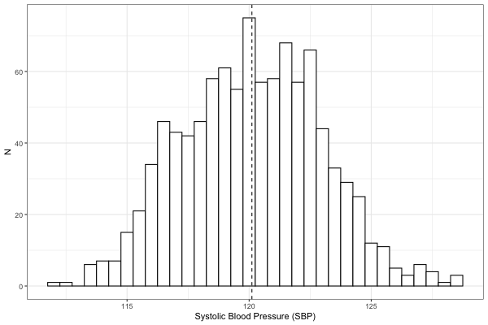
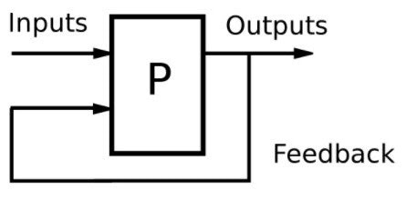

# Comparing the impact of individual vs. contextual variation using intraclass correlation{#title}

  

      EPID 684  
      Spatial Epidemiology  
      3/24/2022  
        
      Jon Zelner  
      `jzelner@umich.edu`  
      [`epibayes.io`](https://epibayes.io) 
    

# Today's Theme {.imgslide}

How can we characterize the relative importance of individual vs. contextual drivers of variation?

# Agenda

>- Review the concept of intraclass correlation

>- Set goals for in-class workshop on 3/31

# What is intraclass correlation?

>- A measure of global clustering.

>- Measures the amount of the total variance in an outcome that is clustered within vs. between groups

>- Groups can include households, neighborhoods, cities, etc.

>- ICC is useful when there is individual-level and spatial variation but it is not clear which is most important

# What is variance?

>- Square of the average deviation from the mean

>- So, if standard deviation: $\sigma$ = 10$, Variance: $\sigma^2$ = 100.

# The total variance is the sum of the within- and between-group variances

$$
\sigma^2_{Total}=\sigma^2_N+\sigma^2_I
$$

- $\sigma^2_N$ = \alert{Between-neighborhood} variance in outcomes.

- $\sigma^2_I$ = Individual level variance in outcomes (\alert{within-neighborhood} variation)

# We can then use these to calculate the ICC

$$
ICC=\frac{\sigma_{N}^2}{\sigma_{N}^2+\sigma_{I}^2}
$$

In words: the ICC is the proportion of the total variation in the outcome that occurs *within* the units we care about.

# A simple worked example {.imgslie}

500 observations of blood pressure with $\bar{x}$ = 120, $\sigma^2$ = 8

# Plotting by neighborhood shows that there is more than just individual variation {.imgslide}

# Use neighborhood means to estimate between-neighborhood variance

# We can use this information to calculate the ICC

>- Total Variance = 8

>- Neighborhood Variance = 3

>- Individual Variance = Total - Neighborhood = 5

>- ICC = $\frac{\text{individual variance}}{\text{total variance}}$ = .375

# What does that mean?

>- About 38% of variation in SBP outcomes is attributable to neighborhood.

>- Seems like a lot, but importance is ultimately relative to the what biological and public health mechanisms are of interest.

>- Provides a basis for comparison with other locations.

# Preparing for What route will you take? workshop

>- Why are we doing this?

>- How should you prepare?

# Effective communication of spatial questions and analyses is central to the goals of this course.

>- Identify well-posed spatial problems in public health and epidemiology.

>- Articulate concrete, informed, goals for spatially-focused public health interventions and research.

>- Suggest appropriate theoretical and analytic frameworks for understanding spatial variation in public health problems and interventions and policies meant to ameliorate them.

# Since these are difficult and complex problems, good feedback is essential to getting your message across {.imgslide}

What does this trolley have to do with feedback? Let me tell you a story...

# What does helpful feedback do? {.imgslide}

Generate insights that facilitate improvement or growth in the topic at hand

# What makes for helpful feedback?

>- Take the perspective of a peer or member of the intended audience who wants to learn about the topic, rather than a teacher/evaluator with an interest in finding flaws.

>- Start by really trying to understand what your partner is trying to acheive. 

>- Be specific in your feedback and keep it close to the paper you're reading.

>- Ask questions: If something doesn't make sense, explain what about it is confusing and ask what they were trying to accomplish. 

>- Flag things you find interesting as well as those that are unclear. Knowing what is working is as or more important than knowing what isn't.

>- Suggest resources or ideas that might help your partner advance their project.

>- [What else?](https://docs.google.com/document/d/13yQxaLqkOsn-SEzS0By8Fo59B_skG3HYYbsu6K4PRGY/edit?usp=sharing)

# Next Time {.imgslide}

[Radon as a window into multi-level modeling](https://publish.obsidian.md/epibayes/Courses/EPID684/modules/Module+4/2.+Digging+into+the+multi-level+approach+to+spatial+analysis)