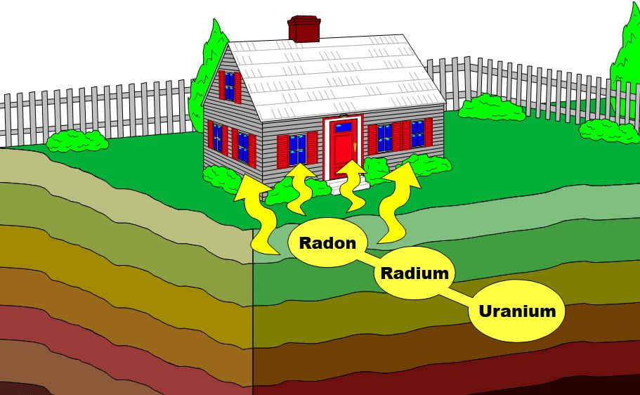
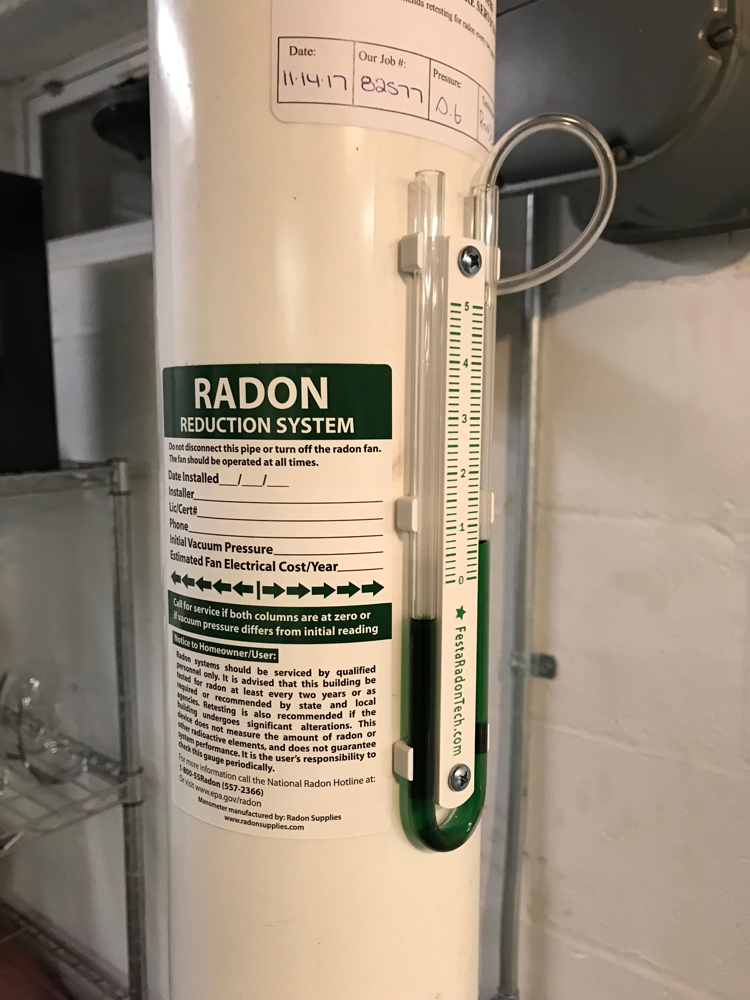
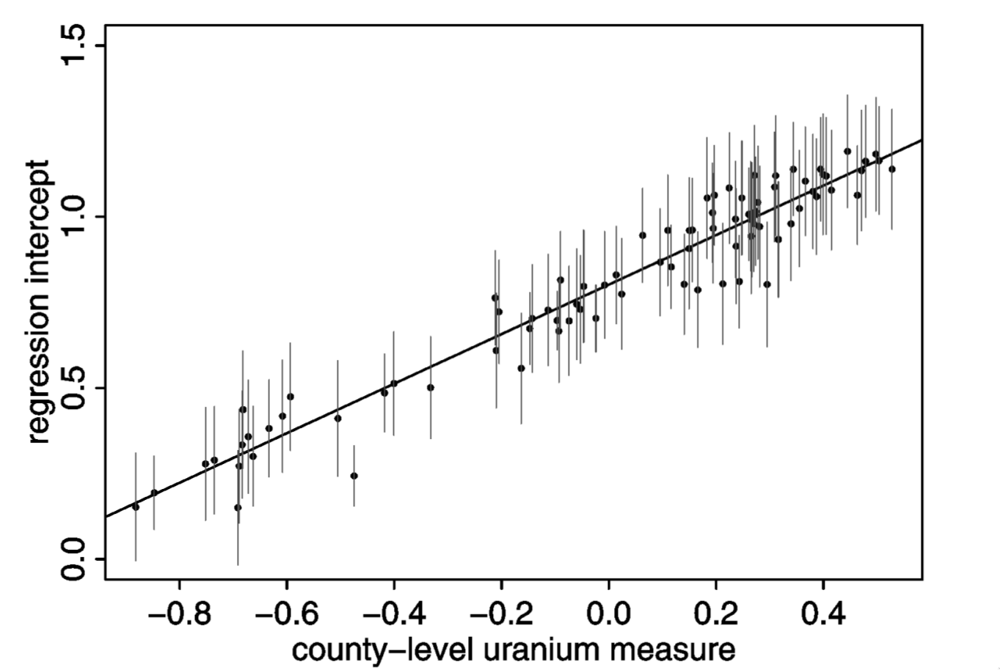
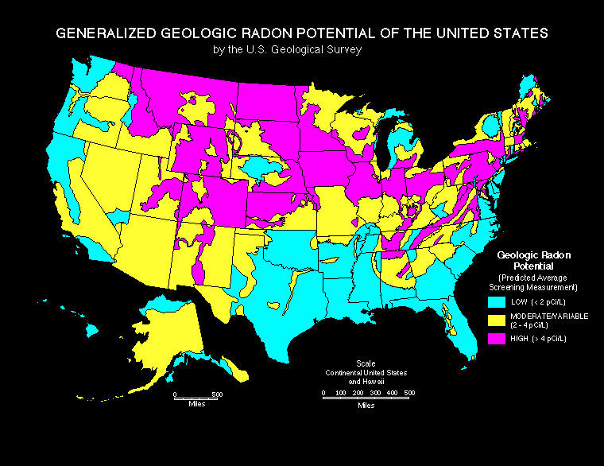
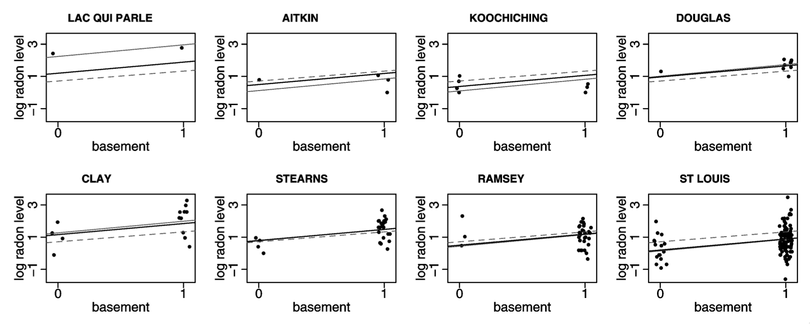

# The threefold path of multilevel modeling {#title}

<div class="paddeddiv">
  <p style="font-size:0.5em; text-align: left;">
      EPID 684  
      Spatial Epidemiology  
      3/24/2022  
      <br><br>
      Jon Zelner  
      `jzelner@umich.edu`  
      [`epibayes.io`](https://epibayes.io) 
    </p>
</div>

<div class="itemr" id="footerDiv"></div>

# Today's <span class="alert">Theme</span> {.imgslide}



[How do hierarchical models make the most use of multi-level data ](https://publish.obsidian.md/epibayes/Courses/EPID684/modules/Module+4/2.+Digging+into+the+multi-level+approach+to+spatial+analysis)

# Agenda

>- Quick overview of prep for thursday [in-class workshop](https://docs.google.com/document/d/1M5Cc-kkibFTGMcLi43pxGTSzZrv5hUg7_dC2puhgNp8/edit).

>- <span class="alert">Worked example</span> of three approaches to multi-level modeling.

>- Discussion of Gelman Minnesota radon ☢️ example 


# Let's <span class="alert">extend</span> the blood pressure model from Merlo et al. to include a <span class="alert">risk/protective</span> factor.

>- Simulated study where we sample 1000 individuals ($i$) from 20 neighborhoods ($j$) and measure:

>- $y_{ij}$ is <span class="alert">continuous</span> systolic blood pressure (SBP) for individual $i$ in location $j$.

>- $x_i \in [0,1]$ is a binary exposure indicating whether the individual gets regular physical exercise.

>- $\beta$ is an increase in $y_i$ associated with the exposure 

>- $\alpha$ is <span class="alert">mean</span> SBP in the absence of exposure

# How can we deal with the fact that people are <span class="alert">clustered</span> within locations? 

<iframe src="https://giphy.com/embed/nz6qNPDA0dpsxbY0rl" width="480" height="304" frameBorder="0" class="giphy-embed" allowFullScreen></iframe>

You have <span class="alert">three choices</span>: Which 🚪 will you choose?

# Door 🚪 #1: Ignore clustering and fit a normal GLM

>- *Pool* data across all units, i.e. ignore clustering.

>- i.e. fit model $y_{ij} = \alpha + \beta x_i + \epsilon_i$

>- Is this typically a good idea?

# <span style="color:red">NO!</span> {.imgslide}


Complete pooling ignores potential sources of *observed* and *unobserved* unit-level <span class="alert">confounding</span>.


# <span class="alert">Full pooling</span> of clustered data violates assumption of independent errors

A <span class="alert"> fully pooled</span> model:

$$
y_i = \alpha + \beta x + \epsilon_i
$$

-  Assumes $y_i$ is a combination of systematic variation ($\alpha + \beta x$) and *uncorrelated* random noise ($\epsilon_i$) where:

$$
\text{i.i.d.} \epsilon \sim Normal(0, \sigma^2)
$$

# Your <span class="alert">residuals</span> should look like this

```{r, echo=FALSE, warning=FALSE, message=FALSE, fig.cap="Example of residuals for model with clustered errors"}
require(ggplot2)
set.seed(1299445)
df <- data.frame(x = rnorm(1000))
g <- ggplot(df, aes(x = x)) +
  geom_histogram(binwidth = 0.1, aes(y=..density..)) +
  stat_function(fun = dnorm, args = list(mean = 0, sd = 1)) +
  xlab("Distance from mean model prediction") +
  ylab("Density") + 
  theme_bw()
plot(g)
```

# Your <span class="alert">residuals</span> should look like this

```{r, echo=FALSE, warning=FALSE, message=FALSE, fig.cap="Example of residuals for model with clustered errors"}
require(ggplot2)
g <- ggplot(df, aes(sample = x)) +
  stat_qq() +
  stat_qq_line()

plot(g)
```

# If you ignore clustering (ICC = 0.9)

```{r, echo=FALSE, fig.cap="Clustered errors"}
require(ggplot2)
icc <- 0.9
total_var <- 1
cluster_sigma <- sqrt(icc * total_var)
ind_sigma <- sqrt((1 - icc) * total_var)
ind_cluster <- 100
ncluster <- 10
#cluster_sigma <- 1
#ind_sigma <- 0.2

cluster_ids <- sort(rep(1:ncluster, ind_cluster))

cluster_means <- rnorm(ncluster, sd = cluster_sigma)
ind_vals <- rnorm(n = length(cluster_ids), mean = cluster_means[cluster_ids], sd = ind_sigma)

df <- data.frame(x = ind_vals, cluster = cluster_ids)

g <- ggplot(df, aes(x = x, cluster = cluster_ids)) +
  geom_histogram(binwidth = 0.05, aes(y=..density..)) +
  xlab("Distance from mean") +
  ylab("Density") +
  stat_function(fun = dnorm, args = list(mean = 0, sd = sqrt(total_var))) +
  theme_bw()


plot(g)
```

# If you ignore clustering (ICC = 0.9)

```{r, echo=FALSE, warning=FALSE, message=FALSE, fig.cap="Example of residuals for model with clustered errors"}
require(ggplot2)
g <- ggplot(df, aes(sample = x)) +
  stat_qq() +
  stat_qq_line() +
  xlab("Theoretical Quantiles") +
  ylab("Observed Quantiles")

plot(g)
```


# If you ignore clustering (ICC = 0.5)

```{r, echo=FALSE, fig.cap="Clustered errors"}
require(ggplot2)
icc <- 0.5
total_var <- 1
cluster_sigma <- sqrt(icc * total_var)
ind_sigma <- sqrt((1 - icc) * total_var)
ind_cluster <- 100
ncluster <- 10
#cluster_sigma <- 1
#ind_sigma <- 0.2

cluster_ids <- sort(rep(1:ncluster, ind_cluster))

cluster_means <- rnorm(ncluster, sd = cluster_sigma)
ind_vals <- rnorm(n = length(cluster_ids), mean = cluster_means[cluster_ids], sd = ind_sigma)

df <- data.frame(x = ind_vals, cluster = cluster_ids)

g <- ggplot(df, aes(x = x, cluster = cluster_ids)) +
  geom_histogram(binwidth = 0.05, aes(y = ..density..)) +
      stat_function(fun = dnorm, args = list(mean = 0, sd = sqrt(total_var))) + 
  xlab("Distance from mean") +
  ylab("Density") + 
  theme_bw()


plot(g)
```

# If you ignore clustering (ICC = 0.5)

```{r, echo=FALSE, warning=FALSE, message=FALSE, fig.cap="Example of residuals for model with clustered errors"}
require(ggplot2)
g <- ggplot(df, aes(sample = x)) +
  stat_qq() +
  stat_qq_line() +
  xlab("Theoretical Quantiles") +
  ylab("Observed Quantiles")

plot(g)
```


# If you ignore clustering (ICC = 0.25)

```{r, echo=FALSE, fig.cap="Clustered errors"}
require(ggplot2)
icc <- 0.25
total_var <- 1
cluster_sigma <- sqrt(icc * total_var)
ind_sigma <- sqrt((1 - icc) * total_var)
ind_cluster <- 100
ncluster <- 10
#cluster_sigma <- 1
#ind_sigma <- 0.2

cluster_ids <- sort(rep(1:ncluster, ind_cluster))

cluster_means <- rnorm(ncluster, sd = cluster_sigma)
ind_vals <- rnorm(n = length(cluster_ids), mean = cluster_means[cluster_ids], sd = ind_sigma)

df <- data.frame(x = ind_vals, cluster = cluster_ids)

g <- ggplot(df, aes(x = x, cluster = cluster_ids)) +
  geom_histogram(binwidth = 0.05, aes(y = ..density..)) +
      stat_function(fun = dnorm, args = list(mean = 0, sd = sqrt(total_var))) + 
  xlab("Distance from mean") +
  ylab("N") + 
  theme_bw()


plot(g)
```

# If you ignore clustering (ICC = 0.25)

```{r, echo=FALSE, warning=FALSE, message=FALSE, fig.cap="Example of residuals for model with clustered errors"}
require(ggplot2)
g <- ggplot(df, aes(sample = x)) +
  stat_qq() +
  stat_qq_line() +
  xlab("Theoretical Quantiles") +
  ylab("Observed Quantiles")

plot(g)
```


# Door 🚪 #2: Fit a <span class="alert">different model</span> to each cluster


>- <span class="alert">Unpooled approach:</span>Fit a separate model to each unit ($j$), assuming outcomes in each unit are independent:

>- Model looks like: $y_{ij} = \alpha_j + \beta_j x_i + \epsilon_{ij}$

>- Where: $\epsilon_{ij} \sim N(0, \sigma_{j}^2)$

# <span class="danger">More danger!</span>


Totally unpooled models run the risk of <span class="alert">overfitting</span> the data, particularly in small samples.

# Specific dangers of unpooled models

>- Some places may have few observations, making *unpooled* models impractical

>- We may want to allow the effect of an exposure to be consistent across location. 

>- Will have nothing to say about data from a new location

# How would our <span class="alert">ideal</span> model split the difference between fully pooled and totally unpooled?

>- Encode the <span class="alert">assumption</span> that places are similar unless data tell us otherwise.

>- Be <span class="alert">flexible</span> enough to reflect information in new data without <span class="alert">overfitting</span>.

>- Give answers equivalent to the <span class="alert">fully pooled</span> and <span class="alert">unpooled</span> approaches if that is what the data actually suggest.

# Door 🚪 #3: Partial Pooling 🏊!


>- Allow <span class="alert">effects</span> to vary across clusters, but constrain them to come from the same distribution:

>- Model looks like: $y_{ij} = \alpha + \beta x_i + \epsilon_{i} + \epsilon_{j}$

>- Where: $\epsilon_{i} \sim N(0, \sigma_{i}^2)$

>- And: $\epsilon_{j} \sim N(0, \sigma_{j}^2)$

# What does partial pooling get us?

>- This approach accommodates variation across units without assuming they have *no* similarity.

>- Allows us to include covariates both about individuals and their spatial context.

>- More likely to make accurate <span class="alert">out-of-sample</span> predictions than the fully-pooled or unpooled examples.


# Imagine you're in the <span class="alert">radon system</span> business {.imgslide}



My very own radon mitigation system!

# How could you use/extend the information in the Gelman paper to:

In small groups:

1. Sell more radon systems?
2. Reduce the burden of inequality in radon-associated risk?
3. Identify potential sources of geographic variation in household-based radon?
4. Anything else?

# As the soil uranium ☢️ increases, so does baseline county-level radon {.imgslide}



# Counties with lots of soil uranium seem like a good bet for business {.imgslide}




# Partial pooling most benefits predictions for places with <span class="alert">less data</span> {.imgslide}



Light dotted line = full pooling; Light solid line = no pooling; Dark line = partial pooling 

# Next Time {.imgslide}

- In-class workshop

