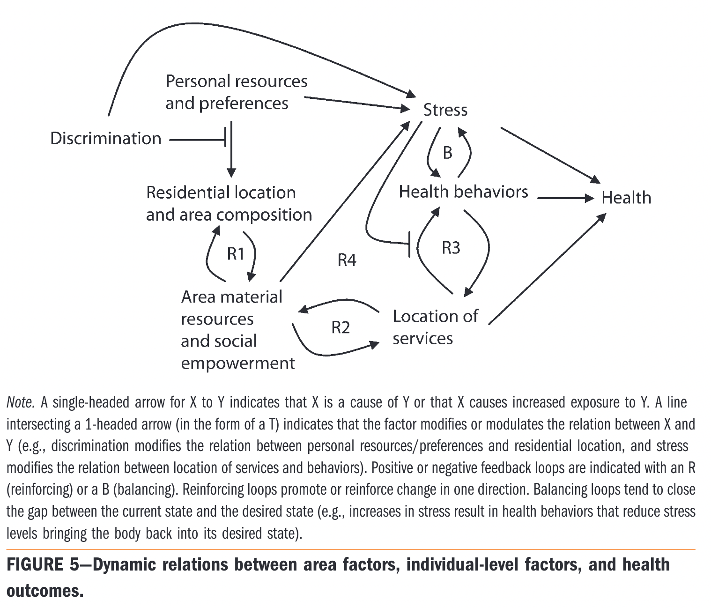
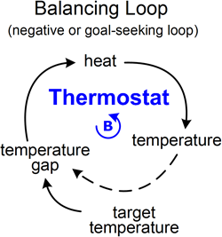
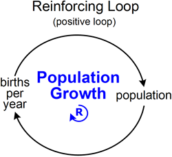
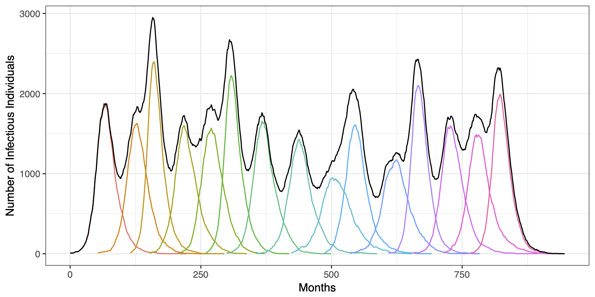

```{r setup, echo=FALSE,warning=FALSE,message=FALSE}
knitr::opts_knit$set(root.dir = rprojroot::find_root(".git/index"))

## This function uses the `here` package to make it easy to include graphics in a directory
## relative to the project root
include_local_graphics <- function(x) {
  knitr::include_graphics(here::here(x))
}
```

# Spatial systems (of systems) in epidemiology {#title}

Jon Zelner   
Epid 684   
University of Michigan    
1/18/2022

# Agenda 

>- Final "Good Map, Bad Map" presentations.
>- What makes for a spatial systems approach to epidemiology?
>- Mapping your own project topics as spatial systems.

# Return of "Good Map, Bad Map"

- [Slide deck](https://docs.google.com/presentation/d/1KJTB9Nq4S4J6aZLtjv0xTADWhEl83nuqX0KP56k8QrY/edit?usp=sharing) 

# Why take a <span class="alert">systems perspective</span> on epidemiology? 

>- If we care about the effect of place, isolating individual risk factors may be counterproductive.
>- Determinants of health and disparities accure over the <span class="alert">lifecourse</span> and have to be understood cumulatively.
>- We might be able to identify the causes of "policy resistance" and ways around them.

## Relative roles of people and places {.quote}

<blockquote>
"Although many studies have documented important differences in neighborhood physical and social environments by race/ethnicity or socioeconomic position, the extent to which these neighborhood differences contribute to disparities in health has remained elusive. <span class="alert">This elusiveness may in part be a result of the virtually exclusive analytical focus on isolating the effects of context and composition.</span> A crucial need is a more nuanced understanding of how the linked processes of residential segregation, differential location of health-related resources, and the behaviors of residents dynamically affect health differentials."
</blockquote>

From Diez Roux et al. 2011

# What does it <span class="alert">mean</span> to take a systems perspective?
<div class="toprow">
<div class="column" style="flex:60%">
>- Characterize system components or states
>- Map feedbacks between states or components of the system.
</div>
<div class="column" style="flex:40%">

</div>
</div>

# Types of feedback
<div class="row">
  <div class="textcolumn">
  <p><span class="alert">Balancing Feedback:</span> When an action gives rise to counter-action, totally or partially
    balancing out the initial one.</p>
  </div>
  <div class="imgcolumn"></div>
</div>

# Types of feedback
<div class="row">
  <div class="textcolumn">
  <p><span class="alert">Reinforcing Feedback:</span> When an action gives rise to counter-action, totally or partially
    balancing out the initial one.</p>
  </div>
  <div class="imgcolumn"></div>
</div>

# Spatial systems (of systems) {.center .sectionbreak}

# Working with complex systems means dealing with <span class="alert">messes</span>. {.r-fit-text}


# Our friend <span class="alert">scale</span> is back {.imgslide}



How many outbreaks we see is really a function of what scale we're looking at or care about.

# A systems perspective on your <span class="alert">problem</span> topic. 

Spend 15m on your own: 

>- Thinking through the components of your system.
>- Characterizing the <span class="alert">relationships</span> between these components.
>- Diagramming out these relationships using the approach from the Diez Roux et al. paper.
>- Focus on *simplicity*, i.e. if you don't think it needs to be there...it doesn't!

<p class = "fragment">Spend 10m in pairs explaining the working of your systems.</p>

## Useful tools for diagramming systems

- [Excalidraw](https://excalidraw.com/)
- [Loopy](https://ncase.me/loopy/v1.1/)
- Powerpoint/Google slides
- Paper/pencil


# Next Time {.imgslide}


Start to make our way into the [1854 London Cholera Outbreak](https://publish.obsidian.md/epibayes/Courses/EPID684/modules/Module+2/Sessions/1.+Walking+into+a+Cholera+epidemic)

# Are the lessons of Broad Street still relevant today?

<blockquote class="twitter-tweet tw-align-center"><p lang="en" dir="ltr">The 1854 cholera epidemic has disproportionately burdened the destitute. Calls for Queen Victoria to provide support for this group have not gone unheard, and she now recommends that these people stop being poor.</p>&mdash; Neoliberal John Snow (@NeoliberalSnow) <a href="https://twitter.com/NeoliberalSnow/status/1481605678355652617?ref_src=twsrc%5Etfw">January 13, 2022</a></blockquote> <script async src="https://platform.twitter.com/widgets.js" charset="utf-8"></script>
