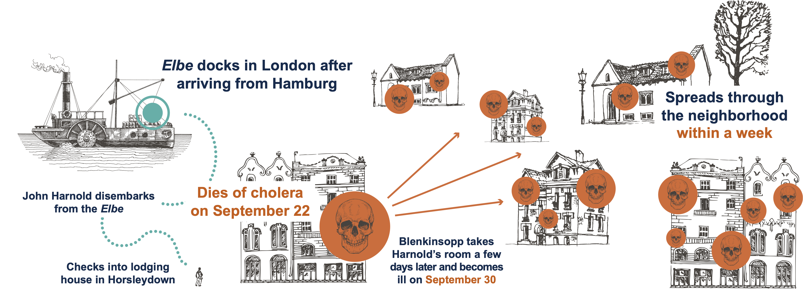

```{r setup, echo=FALSE,warning=FALSE,message=FALSE}
knitr::opts_knit$set(root.dir = rprojroot::find_root(".git/index"))

## This function uses the `here` package to make it easy to include graphics in a directory
## relative to the project root
include_local_graphics <- function(x) {
  knitr::include_graphics(here::here(x))
}
```

# Miasma vs. Germ Theory {#title}

<div class="paddeddiv">
  <p style="font-size:0.5em; text-align: left;">
      EPID 684
      Spatial Epidemiology
      1/25/2022
      <br><br>
      Jon Zelner  
      `jzelner@umich.edu`  
      [`epibayes.io`](https://epibayes.io)
    </p>
</div>

<div class="itemr" id="footerDiv"></div>

# Today's Theme: <span class="alert"> Consilience</span>

> "In science and history, <span class="alert">consilience</span>...is the principle that evidence from independent, unrelated sources can "converge" on strong conclusions. That is, when multiple sources of evidence are in agreement, the conclusion can be very strong even when none of the individual sources of evidence is significantly so on its own."([Wikipedia definition of consilence](https://en.wikipedia.org/wiki/Consilience))

# Agenda

>- Some more discussion of miasma and its explanatory power.
>- Snow's <span class="alert">multi-level</span> miasma debunking.
>- <span class="alert">Smoothing</span> hands-on.

# Small group discussion questions

1. What is <span class="alert">miasma theory</span>? 

2. Why was it a compelling explanation for Cholera in South London?

3. Can you think of any present-day paralells?

4. How did Snow use evidence to start pushing back on miasma?

#

<h1 style="font-size: 3em; color: white; -webkit-text-stroke:2px black">The Road to the 1854 Outbreak</h1>

# Rewind to 1848


# Rewind to 1848


# Rewind to 1848



# I smell a rat...

> "[I]t was stretching matters beyond belief to suggest that the room should suddenly become prone to those poisonous vapors the very day it was occupied by a sailor traveling from a city beseiged by the disease."

# In Snow's words

> "Who can doubt that the case of John Harnold...was the true cause of the malady in Blenkinsopp...And if cholera be communicated in some instances, is there not the strongest possibility that it is so in the others - in short, that <span class="alert">similar effects depend on similar causes<span>."

# Building the case for the water supply

>- Snow noticed that different neighborhoods were likely to have differential exposure to wastewater based on their geographic position in the city and water supplier.

>- Consulted tables from the city of London and found that the per-capita Cholera death rate south of the Thames was 8/1000, approx 3x more than the city as a whole.

# 1849 Thomas street outbreak drove these ideas home for Snow {.quote}

> "Whether you looked at the evidence on the scale of an urban courtyard or on the scale of entire city neighborhoods, the same pattern repeated itself: the cholera seemed to segment itself around shared water supplies. <span class="alert">If the miasma theory were right, why would it draw such arbitrary distinctions?</span> Why would the cholera devastate one building but leave the one next door unscathed? Why would one slum suffer twice the losses as a slum with arguably worse sanitary conditions?" (Johnson, p.74)

# There's that systems perspective again...

> "The bird’s-eye view of the city, the sense of the urban universe as a system, as a mass phenomenon—this imaginative breakthrough is as crucial to the eventual outcome of the Broad Street epidemic as any other factor." (Johnson, p.97)

# {data-background-image="../images/snow_water_map.jpg"}

<h1 style="font-size: 3em; color: white; -webkit-text-stroke:2px black">The Grand Experiment</h1>

# What was the *experimentum crucis*?

>- Snow took advantage of changes in infrastructure to compare neighborhoods served with contaminated and clean water.
>- Example of a natural experiment.
>- Exploits some kind of random variation in exposure to make causal inferences where they would otherwise not be possible.
>- What are some examples of a natural experiment?


# Changes in London water service provided an opportunity 
<div class="toprow">
  <div class="textcolumn">
  <ul>
  <li>Around 1850, parliament mandated that all water companies move their intake beyond the outflow of the Thames by 1855</li>
  <li class="fragment">In south London there were two major water suppliers: Southwark & Vauxhall (S&V) and Lambeth.</li>
  <li class="fragment">Lambeth moved the intake up in 1852, but S&V waited until 1855.</li>
  </div>

  <div style="flex:50%">
    <p style="font-size: 0.5em">Snow's Water Supply Map</p></div>
</div>
-


## Snow's map of water suppliers


# Conducting the grand experiment

>- Snow divided data into sub-districts of South London organized by water supplier.
>- 12 were served by only S&V, 3 by Lambeth alone
>- <span class="alert">1/100</span> people died of Cholera in S&V only districts, but none among the > 14K living in Lambeth districts

# What was the wrinkle in the Grand Experiment?

>-  16 sub-districts were served by both suppliers
>- Within these districts, water service was overlapping at a fine scale.
>- Snow went door-to-door...but people living in these districts often had no idea where their water came from.
>- So, he collected water from them and tried to find evidence of the causal agent of Cholera in the sample


# Smoothing & the return of Tobler's first law


> "[E]verything is related to everything else, but near things are more related than distant things."

# What is <span class="alert">smoothing</span>?

<div class="fragment">
<iframe src="https://giphy.com/embed/X0iqiPHFdrEctzDKMU" width="480" height="270" frameBorder="0" class="giphy-embed" allowFullScreen></iframe>
<p style="text-align: center;"> Smoothing lets us separate signal from noise.</p>
</div>

# What are some examples of epidemiological <span class="alert">signals</span>?

>- Causal <span class="alert">relationship</span> between a risk factor and an outcome.
>- Trend in a <span class="alert">time series</span>
>- Disease <span class="alert">hotspot</span> in a spatial dataset.

# What are some sources of <span class="alert">noise</span> we might encounter in epidemiological data?

>- Random variation, i.e. <span class="alert">process noise</span>.
>- Observation <span class="alert">error</span>.
>- Exposure <span class="alert">misclassification</span>.

# A hands-on example

<a href="https://sph-umich.shinyapps.io/smoothing">
 
</a>

<p style="text-align: center;"><a href="https://sph-umich.shinyapps.io/smoothing">Smoothing!</a><p>
