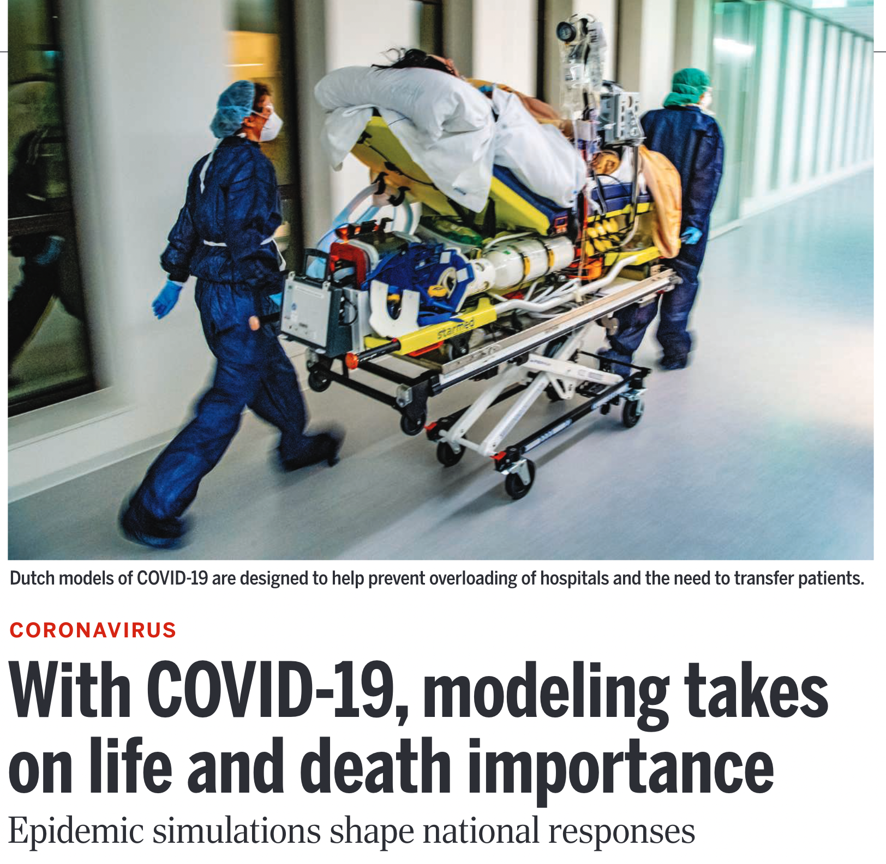
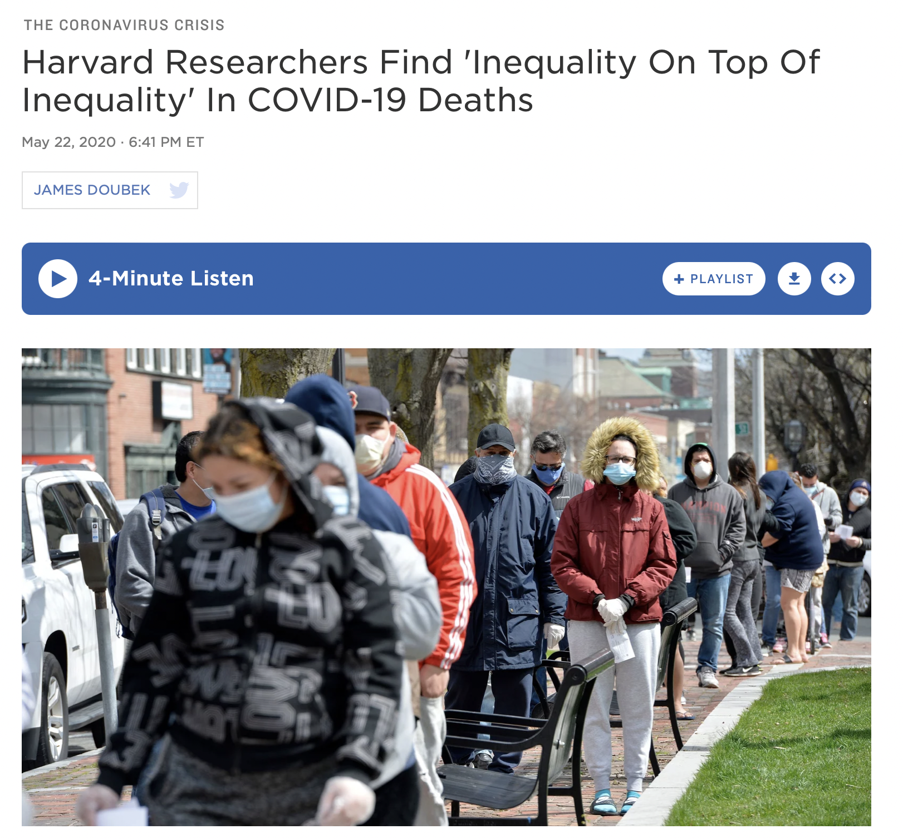
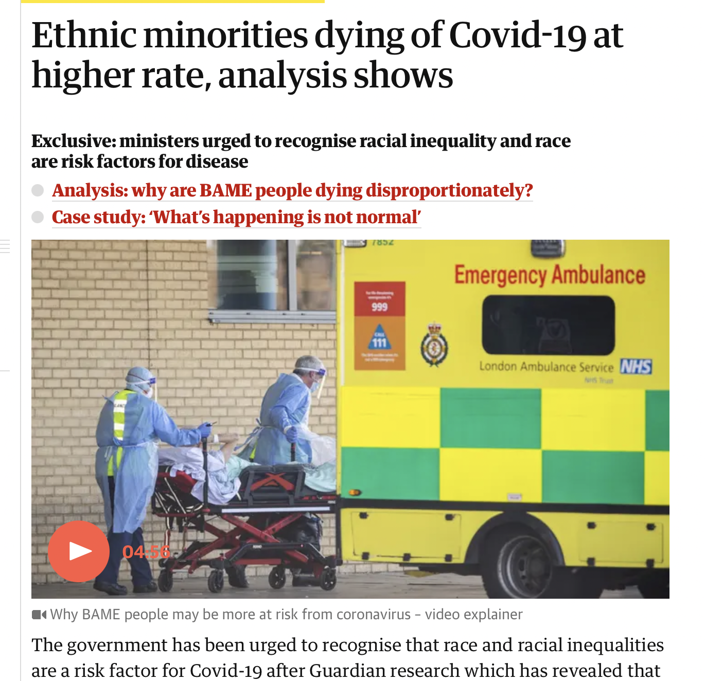
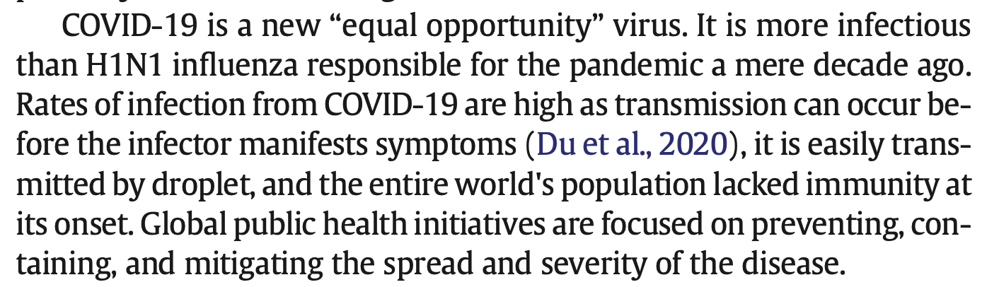
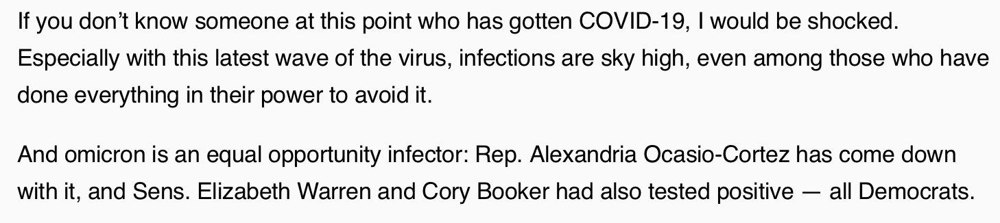
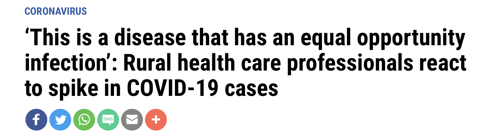
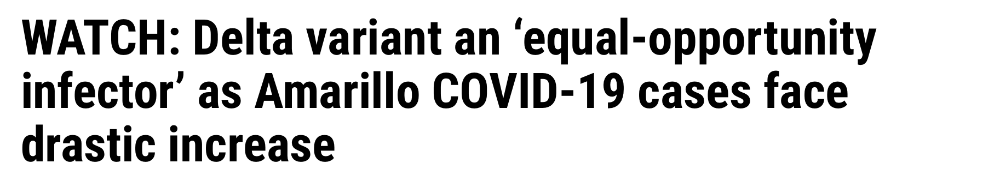
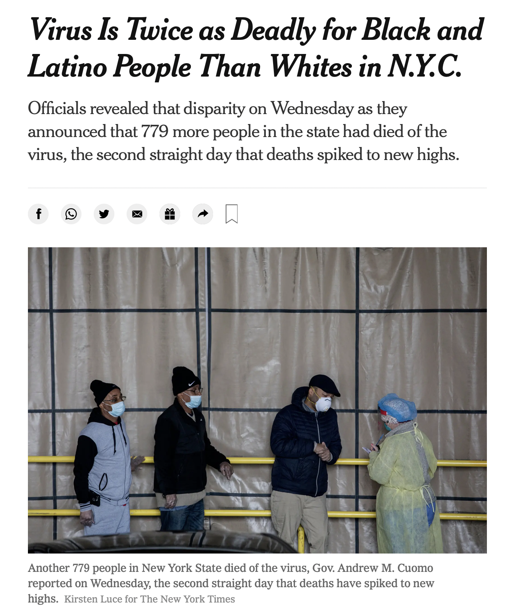

```{r setup, echo=FALSE,warning=FALSE,message=FALSE}
knitr::opts_knit$set(root.dir = rprojroot::find_root(".git/index"))

## This function uses the `here` package to make it easy to include graphics in a directory
## relative to the project root
include_local_graphics <- function(x) {
  knitr::include_graphics(here::here(x))
}
```

# There are no equal opportunity infectors {#title}

<div class="paddeddiv">
  <p style="font-size:0.5em; text-align: left;">
      Jon Zelner  
      *10th Annual Conference to Increase Diversity*  
      *in Mathematical Modeling and Public Health*   
      1/21/2022 
  </p>
</div>

<div class="itemr" id="footerDiv"></div>

# Goals

>- Discuss why epidemiological models (and modelers) have ignored inequality in our approach to pandemic preparedness.
>- Suggest an alternate path that builds on the many strengths and successes of modeling in the COVID-19 response.
>- Highlight why developing models that reflect a diversity of understandings about how transmission systems work is essential for equitable preparedness and population health.

# {.imgslide}

<h1 style="font-size:1.5em"><span class="alert">Modelers</span> have been key to COVID-19 response</h1>  



From Enserink and Kupferschmidt, *Science* 2020

# Modeling has become a key element of pandemic <span class="alert">preparedness</span>. {.imgslide}

<blockquote>"Pandemic preparedness is a continuous process of planning, exercising, revising and translating into action national and
sub-national pandemic preparedness and response plans. A pandemic plan is thus a <span class="alert">living document</span> which is reviewed regularly and revised if necessary...based on the lessons learnt from outbreaks or a pandemic, or from a
simulation exercise."</blockquote>

[WHO 2011](https://www.euro.who.int/en/health-topics/communicable-diseases/influenza/pandemic-influenza/pandemic-preparedness)

# Early pandemic models focused on key <span class="alert">priorities</span>

<ul>
  <li class="fragment">Age-specific incidence and mortality.</li>
  <li class="fragment">Hospital and ICU capacity.</li>
  <li class="fragment">Short-term forecasting of population incidence and mortality</li>
  <li class="fragment">Impacts of lockdowns on infection risk.</li>
  <span class="fragment">
    <span class="fragment strike highlight-red">
      <li>
        Economic and racial inequality in infection and disease risk</li>
    </span></span>
</ul>

# Economic and racial inequity is a central story of the COVID-19 pandemic {.imgslide}

<div class="r-stack">
  
  
  
  
  </div>

So why were we not <span class="alert">prepared</span> for these easy-to-foresee inequities?

# The myth of the <span class="alert">equal opportunity infector</span> may have obscured inequality

<div class="r-stack">
  
  
  
  
  </div>


# What does it mean to be an equal opportunity infector?

 >- <span class="alert">Susceptibility</span> is uniformly distributed across the population.
 >- Host and pathogen biology are the most important factors in determining <span class="alert">infectiousness.</span>
 >- Protective <span class="alert">health behaviors</span> equally available to everyone.
>- Social differences in <span class="alert">exposure</span> by race and wealth are dwarfed by these biological factors.
</span>

<span class="fragment">*Modelers don't have to believe these things are true for them to end up in our models!*</span>

# We have to understand the <span class="alert">mental models</span> guiding our mathematical ones to figure out how to fix them. {.quote}

<blockquote>[M]ental models and empirical data keep each other in check - [Sir Peter Medawar] described them 
  respectively as the ‘bride’ and ‘groom’ of science — and scientific progress in any discipline occurs by the
  back-and-forth dialogue between their two ‘voices’.”</blockquote>

  [From Greenhalgh 2021: *Miasmas, mental models and preventive public
  health*](https://royalsocietypublishing.org/doi/10.1098/rsfs.2021.0017)


# Dissecting the mental model behind the <span class="alert">equal opportunity infector</span> idea 

Key Questions:

>- What types of <span class="alert">data</span> do these models use? Why?
>- Who has been the typical <span class="alert">audience</span> for epidemiological models? Is that changing?
>- What can we do to expand our toolkit to address these critical questions?

# Who are epidemiological models <span class="alert">for</span>?

>- Public health officials making *decisions*.
>- Scientists and physicians pursuing *interventions*.
>- Politicians implementing *policy* and trying to maintain *power*.
>- Media constructing an easily-digestible *narrative*.

<p class="fragment" style="text-align: center;">What <span class="alert">perspective</span> do these groups have in
  common?</p>


# This has led to a focus on a set of <span class="alert">outcomes</span> that aligns with these interests

<ul>
  <li class="fragment">Incidence of disease over time.</li>
  <li class="fragment">Prevalence of infection at any given moment in time.</li>
<li class="fragment">Mortality and case-fatality rates.</li>
  <li class="fragment">Distributions of infection and mortality by age.</li>
  <span class="fragment">
    <span class="fragment strike highlight-red">
      <li>Distribution of infection and mortality by ethnicity.</li></span></span>
</ul>

# Epidemiological modeling has emerged from a rich tradition in <span class="alert">population ecology</span>

>- Key model parameters like $R_0$ describe *average* properties of infection in a whole population.
>- Key ideas are borrowed from classic models of predator/prey dynamics and birth/death processes.
>- Ecological modeling has a deep toolkit for characterizing <span class="alert">demographic</span> and <span class="alert">spatial</span> variation in outcomes.
>- But these tools have yet to make the leap to characterizing the <span class="alert">socio-structural</span> determinants of infection.

# OK, but this was so <span style="color:red">obvious!</span>

<a href="/gif/charlie-brown-and-lucy-kicking-the-football-HCU0O8"
  title="Charlie Brown and Lucy - kicking the FOOTBALL"></a>
<div style="font-size:12px;">How did we miss this critical dimension of preparedness?</div>

# Modeler $\to$ Mental Model $\to$ Transmission Model

>- It matters <span class="alert">who</span> is developing the model.
>- Modeling needs to reflect diveristy in <span class="alert">intellectual perspectives</span>
>- And life experiences
>- And economic and political interests
>- Historically, modeling has skewed White, male & wealthier, and the failures of preparedness reflect those roots.

# What could an <span class="alert">alternative</span> framework look like? {.imgslide}


## What might explain this inequality in <span class="alert">mortality</span>? 

<div class="toprow">
  <div class="textcolumn">
  <ul>
  <li class="fragment">Higher prevalence of comorbidities, e.g. obesity</li>
  <li class="fragment">Poorer access to healthcare</li>
  <li class="fragment">Residence in multigenerational households</li>
  <li class="fragment">Prevalence of "essential work"</li>
  </div>
  <div style="flex:50%"></div>
</div>


