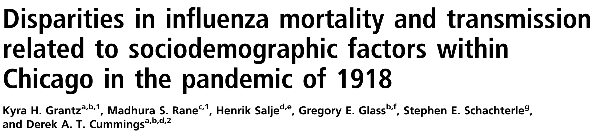

```{r setup, echo=FALSE,warning=FALSE,message=FALSE}
knitr::opts_knit$set(root.dir = rprojroot::find_root(".git/index"))

## This function uses the `here` package to make it easy to include graphics in a directory
## relative to the project root
include_local_graphics <- function(x) {
  knitr::include_graphics(here::here(x))
}
```

# There are no equal opportunity infectors {#title}

<div class="paddeddiv">
  <p style="font-size:0.5em; text-align: left;">
      *10th Annual Conference to Increase Diversity*  
      *in Mathematical Modeling and Public Health*   
      1/21/2022
      <br><br>
      Jon Zelner  
      `jzelner@umich.edu`  
      [`epibayes.io`](https://epibayes.io)
    </p>
</div>

<div class="itemr" id="footerDiv"></div>

# Goals

>- Discuss why epidemiological models - and <span class="alert">modelers</span> - have ignored inequality in our approach to pandemic preparedness.
>- Suggest an <span class="alert">alternate path</span> that builds on the many strengths and successes of modeling in the COVID-19 response.
>- Highlight why developing models that reflect a diversity of understandings about <span class="alert">how transmission systems work</span> is essential for equitable preparedness and population health.

# {.imgslide}

<h1 style="font-size:1.5em"><span class="alert">Modelers</span> have been key to COVID-19 response</h1>  


From Enserink and Kupferschmidt, *Science* 2020

# Modeling has become a key element of pandemic <span class="alert">preparedness</span>. {.imgslide}

<blockquote>"Pandemic preparedness is a continuous process of planning, exercising, revising and translating into action national and
sub-national pandemic preparedness and response plans. A pandemic plan is thus a <span class="alert">living document</span> which is reviewed regularly and revised if necessary...based on the lessons learnt from outbreaks or a pandemic, or from a
simulation exercise."</blockquote>

[WHO
2011](https://www.euro.who.int/en/health-topics/communicable-diseases/influenza/pandemic-influenza/pandemic-preparedness)

# Much of the power of models comes from how they shape our <span class="alert">intuition</span>

Models can let us:

<div class="toprow">
  <div class="textcolumn"><ul>
    <li class = "fragment">Characterize rates of transmission, severe disease and death in assorted populations.</li>
    <li class = "fragment">Estimate the impact of medical interventions on risk.</li>
    <li class="fragment">Explore the implications of social and political change on infection risk.</li>
    </ul></div>

  <div style="flex:50%"><blockquote style="font-size: 0.6em;">
    Intuition pumps are cunningly designed [thought experiments, which] <span class="alert">focus the reader's attention on "the important"
    features</span>, and...deflect the
    reader from bogging down in hard-to-follow details. (From Dennett, 1984)</blockquote></div>
</div>

# Early pandemic models focused on key <span class="alert">priorities</span>

<ul>
  <li class="fragment">Age-specific incidence and mortality.</li>
  <li class="fragment">Hospital and ICU capacity.</li>
  <li class="fragment">Short-term forecasting of population incidence and mortality</li>
  <li class="fragment">Impacts of lockdowns on infection risk.</li>
  <span class="fragment">
    <span class="fragment strike highlight-red">
      <li>
        Economic and racial inequality in infection and disease risk</li>
    </span></span>
</ul>

# Economic and racial inequity is a central story of the COVID-19 pandemic {.imgslide}

<div class="r-stack">
  
  
  
  
  </div>

So why were we not <span class="alert">prepared</span> for these easy-to-foresee inequities?

# The myth of the <span class="alert">equal opportunity infector</span> may have obscured inequality

<div class="r-stack">
  
  
  
  
  </div>


# What does it mean to be an equal opportunity infector?

 >- <span class="alert">Susceptibility</span> is uniformly distributed across the population.
 >- Host and pathogen biology are the most important factors in determining <span class="alert">infectiousness.</span>
 >- Protective <span class="alert">health behaviors</span> equally available to everyone.
>- Social differences in <span class="alert">exposure</span> by race and wealth are dwarfed by these biological factors.
</span>

<span class="fragment">*Modelers don't have to believe these things are true for them to end up in our models!*</span>

# We have to understand the <span class="alert">mental models</span> guiding our mathematical ones to figure out how to fix them. {.quote}

<blockquote>[M]ental models and empirical data keep each other in check - [Sir Peter Medawar] described them 
  respectively as the ‘bride’ and ‘groom’ of science — and scientific progress in any discipline occurs by the
  back-and-forth dialogue between their two ‘voices’.”</blockquote>

  [From Greenhalgh 2021: *Miasmas, mental models and preventive public
  health*](https://royalsocietypublishing.org/doi/10.1098/rsfs.2021.0017)


# Dissecting the mental model behind the <span class="alert">equal opportunity infector</span> idea 

Key Questions:

>- What types of <span class="alert">data</span> do these models use? Why?
>- Who has been the typical <span class="alert">audience</span> for epidemiological models? Is that changing?
>- What can we do to expand our toolkit to address these critical questions?

# Who are epidemiological models <span class="alert">for</span>?

>- Public health officials making *decisions*.
>- Scientists and physicians pursuing *interventions*.
>- Politicians implementing *policy* and trying to maintain *power*.
>- Media constructing an easily-digestible *narrative*.

<p class="fragment" style="text-align: center;">What <span class="alert">perspective</span> do these groups have in
  common?</p>


# This has led to a focus on a set of <span class="alert">outcomes</span> that aligns with these interests

<ul>
  <li class="fragment">Incidence of disease over time.</li>
  <li class="fragment">Prevalence of infection at any given moment in time.</li>
<li class="fragment">Mortality and case-fatality rates.</li>
  <li class="fragment">Distributions of infection and mortality by age.</li>
  <span class="fragment">
    <span class="fragment strike highlight-red">
      <li>Distribution of infection and mortality by socieconomic status and race/ethnicity.</li></span></span>
</ul>

# Modeling of <span class="alert">acute infections</span> has emerged from a rich tradition in population ecology

>- Key model parameters like $R_0$ traditionally describe *average* properties of infection in a well-mixed population.
>- Key ideas are borrowed from classic models of predator/prey dynamics and birth/death processes.
>- Ecological modeling has an extensive toolkit for characterizing <span class="alert">demographic</span> and <span class="alert">spatial</span> variation in outcomes.
>- But we have been slow to make the leap to characterizing the <span class="alert">socio-structural</span> determinants of infection.

# OK, but this was so <span style="color:red">obvious!</span>

<a href="/gif/charlie-brown-and-lucy-kicking-the-football-HCU0O8"
  title="Charlie Brown and Lucy - kicking the FOOTBALL"></a>

<div style="font-size:1em;">How did we miss the fact that <span class="alert">justice</span> is a critical dimension of preparedness?</div>

# Historical analyses have repeatedly demonstrated inequity in prior pandemics {.imgslide}



[Grantz et al., *PNAS* 2016](https://pubmed.ncbi.nlm.nih.gov/27872284/)

# The mechanisms of inequity were quickly identified, but our models weren't ready for them {.imgslide}


# COVID-19 provides an opportunity to reflect on the goals of transmission modeling {.quote}

<blockquote>
  COVID-19 disparities are not the fault of those who are experiencing them, but rather reflect social policies and
  systems that create health disparities in good times and inflate them in a crisis. <span class="alert">The US must develop a new kind of
  “herd immunity,” whereby resistance to the spread of poor health in the population occurs when a sufficiently high
  proportion of individuals, across all racial, ethnic, and social class groups, are protected from and thus “immune” to
  negative social determinants.</span>
</blockquote>
 From Williams & Cooper, ["COVID-19 and Health Equity—A New Kind of “Herd Immunity”](https://jamanetwork.com/journals/jama/fullarticle/2766096), JAMA, 6/23/2020

# What could an <span class="alert">alternative</span> framework look like? 
<div class="toprow">
  <div class="textcolumn"><ul>
      <li class="fragment">Model <span class="alert">proximal</span> infection risks as a function of upstream determinants.</li>
      <li class="fragment">Represent <span class="alert">correlation</span> between effects of factors such as racism and SES.</li>
      <li class="fragment">Examine differential impacts of social inequity on <span class="alert">contact</span>, <span class="alert">susceptibility</span>, and <span class="alert">infectiousness.</span></li>
    </ul>
  </div>

  <div style="flex:50%">
    <p style="font-size: 0.5em">Zelner et al. (2022), *There are no equal opportunity infectors.*
    PLOS Computational Biology, *In Press*  
    (Preprint available [here](https://arxiv.org/abs/2109.00580).)</p></div>
</div>


# This shift is already well underway

<a href="https://elifesciences.org/articles/66601"></a>

</a>

# These <span class="alert">equity-oriented</span> models let us ask crucial questions about the causes of disparity {.imgslide}


From Nande et al. ["The effect of eviction moratoria on the transmission of SARS-CoV-2"](https://doi.org/10.1038/s41467-021-22521-5
), Nature Communications, 2021

# Modeler $\to$ Mental Model $\to$ Transmission Model

>- It matters <span class="alert">who</span> is developing the model.
>- Modeling needs to reflect diveristy in <span class="alert">intellectual perspectives</span>
>- And <span class="alert">life experiences</span>
>- And <span class="alert">economic</span> and <span class="alert">political</span> interests

# Thanks!

If you're interested in learning more about our work, check our lab site at [epibayes.io](https://epibayes.io)


<figure>
<a href="https://epibayes.io">

</a>
</figure>

<p style="font-size: 0.9em; text-align: center;">Get in touch at `jzelner@umich.edu`!</p>
# Epibayes Team
<div class="teamPicsDiv">
 <!-- Jon -->
 <div class="teamMember">
  
  <a class="teamName" href="https://epibayes.io/author/jon-zelner/" target="_blank">Jon Zelner</a>
 </div>
 <!-- Hannah -->
 <div class="teamMember">
  
  <a class="teamName" ref="https://epibayes.io/author/hannah-steinberg/" arget="_blank">Hannah Steinberg</a>
 </div>
 <!-- Joey -->
 <div class="teamMember">
  
 <a class="teamName" href="https://epibayes.io/author/joey-dickens/" target="_blank">Joey Dickens</a>
 </div>
 <!-- Kelly -->
 <div class="teamMember">
  
  <a class="teamName" href="https://epibayes.io/author/kelly-broen/" target="_blank">Kelly Broen</a>
 </div>
 <!-- Krzysztof -->
 <div class="teamMember">
  
  <a class="teamName" href="https://epibayes.io/author/krzysztof-sakrejda/" target="_blank">Krzysztof Sakrejda</a>
 </div>
 <!-- Paul -->
 <div class="teamMember">
  
  <a class="teamName" href="https://epibayes.io/author/paul-delamater/" target="_blank">Paul Delamater</a>
 </div>
 <!-- Ramya -->
 <div class="teamMember">
  
  <a class="teamName" href="https://epibayes.io/author/ramya-naraharisetti/"  target="_blank">Ramya Naraharisetti</a>
 </div>
 <!-- Rob -->
 <div class="teamMember">
  
  <a class="teamName" href="https://epibayes.io/author/rob-trangucci/" target="_blank">Rob Trangucci</a>
 </div>
 <!-- Stephanie -->
 <div class="teamMember">
  
  <a class="teamName" href="https://epibayes.io/author/stephanie-choi/" target="_blank">Stephanie Choi</a>
 </div>
</div>
