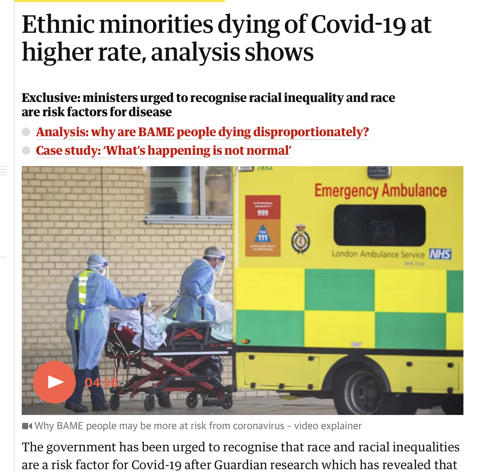

```{r setup, echo=FALSE,warning=FALSE,message=FALSE}
knitr::opts_knit$set(root.dir = rprojroot::find_root(".git/index"))

## This function uses the `here` package to make it easy to include graphics in a directory
## relative to the project root
include_local_graphics <- function(x) {
  knitr::include_graphics(here::here(x))
}
```

# There are no equal opportunity infectors {#title}

<div class="spacedrow">
  <div class="iteml">
  <p style="font-size:0.5em">
      Jon Zelner  
      *10th Annual Conference to Increase Diversity in Mathematical Modeling and Public Health* 
      1/21/2022 
  </p>
  </div>
  <div class="itemr">
  
  </div>
</div>

# Agenda 

# Who am I?

>- Infectious disease epidemiologist and sociologist
>- Assistant Professor of Epidemiology at UM since 2017
>- Core faculty member in the *Center for Social Epidemiology and Population Health* (CSEPH) at UM
>- Research group focused on infectious disease ([epibayes.io](https://epibayes.io))
>- PhD in Sociology and Public Policy from Michigan (2011)
>- Teach undergrad and grad courses on <span class="alert">spatial epidemiology</span> and the <span class="alert">social history of infectious disease</span>

# {.imgslide}

<h1 style="font-size:1.5em"><span class="alert">Modelers</span> have been key to COVID-19 response</h1>  


From Enserink and Kupferschmidt, *Science* 2020

# Early pandemic models focused on <span class="alert">established</span> priorities

>- Age-specific incidence and mortality.
>- Hospital and ICU capacity.
>- Short- and long-term forecasting of incidence and mortality.
>- Impacts of lockdowns on infection risk.

<p class="fragment">
<span class="alert">Inequality</span> was not one of the key early foci.
</p>

# Inequity in infection and death was clear from the outset {.imgslide}

<div class="r-stack">



</div>

# Speculation about causes of disparate mortality relied on well-worn ideas about <span class="alert">health disparities</span>

<div class="row">
  <div class="textcolumn">
  <ul>
  <li class="fragment">Higher prevalence of comorbidities, e.g. obesity</li>
  <li class="fragment">Poorer access to healthcare</li>
  <li class="fragment">Multigenerational households</li>
  <li class="fragment">Prevalence of "essential work"</li>
  </div>
  <div class="imgcolumn"></div>
</div>


# Who are transmission models <span class="alert">for</span>?

>- Public health officials
>- Scientists
>- Politicians
>- Media

<p class="fragment">What <span class="alert">perspective</span> do these groups have in common?</p>