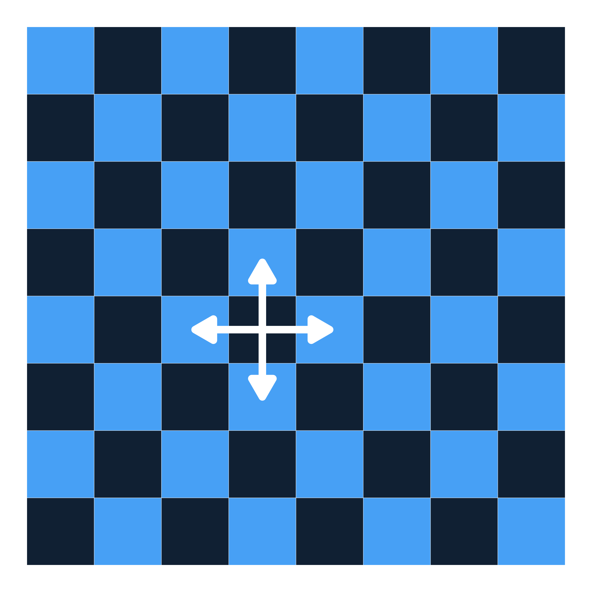
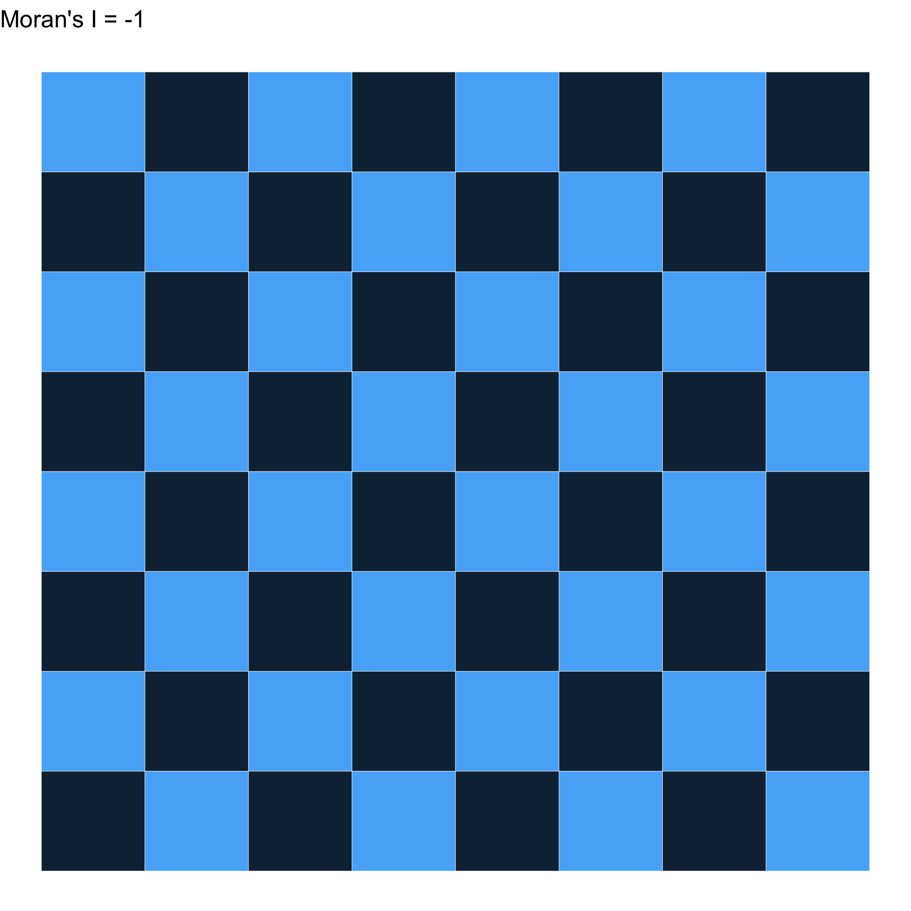
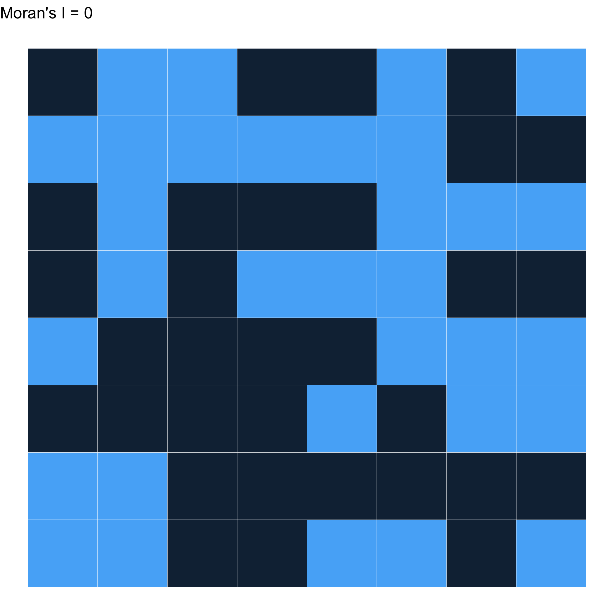

  
# Measuring the spatial clustering of non-vaccination and its implications for population health {#title}

  

      EPID 684  
      Spatial Epidemiology  
      3/17/2022  
        
      Jon Zelner  
      `jzelner@umich.edu`  
      [`epibayes.io`](https://epibayes.io) 
    

# Today's Theme {.imgslide}

(Still) Measuring and understanding the public health implications of spatially clustered susceptibility through the lens of vaccine 💉 hesitancy.

# Agenda

>- Characterizing spatial heterogeneity and clustering of non-vaccination in the U.S.

>- Introduction to Moran's I and the concept of spatial neighbor weighting.

>- Comparing conclusions drawn by using isolation, 

# Some questions about Olive et al.

>- What might explain the increase in spatial clustering of non-medical exemptions to pediatric vaccination over time?

>- What are the public health implications of this kind of spatially-clustered susceptibility to infections like measles?

>- How could this information be used to prevent outbreaks?

>- What do you think might be limitaitons of a spatially focused approach to the problem of vaccine hesitancy?

# A new metric has entered the arena! {.imgslide}

Clustering measures over time and across scales, from Masters et al. 2021.

# Bringing space into clustering metrics {.imgslide}

 

First, we have to decide who are neighbors are!

# What is a spatial neighbor?

>- A spatial area that is related to the one of interest.

>- Areas that are touching are called *contiguity neighbors*.

>- But: Contiguity is not a necessary or sufficient condition for two places to be neighbors. 

>- How else could neighbors/neighborhoods defined?

# Contiguity neighbors are defined in terms of *chess moves*. {.imgslide}

# Areas sharing a *border* have Rook's contiguity {.imgslide}

# But what about the corners? {.imgslide}

# Areas sharing at least a single *vertex* have *Queen's* contiguity {.imgslide}

# We can translate these into spatial weights

 >- These represent the strength of spatial interaction

 >- Simplest is to assign $w_{ij} = 1$ for neighbors and $w_{ij} = 0$ otherwise.

 >- Weights can vary with distance and other attributes, such as travel time.

# Choice of weights has to be motivated by theory

>- Selected weights should reflect our understanding of the underlying spatial *process* at work. 

>- This could include social factors, biological features of the disease of interest, environmental factors, etc.

>- Necessary to look at multiple ways of specifying weights to see if your outcomes are *robust* to different definitions. 

# What is Moran's I?

>- A measure of spatial *autocorrelation* in outcomes between *areas*.

>- A measure of global clustering.

>- Takes values from -1 to 1

>- A very commonly used (and misused) measure of spatial clustering

# What does it measure? 

>- Negative values of *I* indicate that neighboring areas are more likely to be dissimilar to each other than non-neighboring ones.

>- Positive values indicate that neighboring values are more likely to be similar to each other. 

>- Can accomodate a range of ways of calculating values and distances, but here we'll stick to something simple.

# How is it calculated?

$$
I = \frac{N}{W} \frac{\sum_{i} \sum_{j} w_{ij} (x_i - \bar{x})(x_j - \bar{x})}{\sum_{i}(x_i \bar{x})^2}
$$

Where:

>- N is the number of spatial areas.
>- W is the sum of all the spatial \alert{weights}
>- $x_i$ and $x_j$ are the values of the i-th and j-th cells
>- $w_{ij}$ indicates whether i & j are neighbors (yes = 1, no = 0 )
>- $w_ij = 0$ when $i = j$
>- $\bar{x}$ is the mean value of x across all squares

# In words, please?

$$
I = \frac{N}{W} \frac{\sum_{i} \sum_{j} w_{ij} (x_i - \bar{x})(x_j - \bar{x})}{\sum_{i}(x_i \bar{x})^2}
$$

How far is the product of the difference from the population mean of $x_i$ values in neighboring squares  from the average distance from the mean for all squares?

# Let's start by looking at how this works using *Rook's* contiguity {.imgslide}

# As close as you can get to -1 {.imgslide}

# As clustered as you can get $\to$ 1 {.imgslide}

# Randomly distributed $\approx$ 0 {.imgslide}

# Randomly distributed $\approx$ 0 {.imgslide}

# How does the choice of weights impact this? {.imgslide}

Let's try with Queen's contiguity!

# Different weights $\to$ A different result... {.imgslide}

# What can we learn with this?

>- Understand whether the distribution of a disease across areas is clustered.

>- Sensitive to the choice of weights, shape of spatial units, and on and on...

>- Still a global measure, i.e. says something about the average, but may obscure more local patterns.

# Focusing in on non-vaccination risks in Michigan 

>- What do you think the most important takeaway from Masters et al. is?

>- How does our choice of measure impact the conclusions we draw over time ? 

>- Why do you think aggregating data across spatial scales can have such a strong impact on our measures?

>- What are some of the potential practical implications of the error that comes from this kind of aggregation?

# Next Time

>- Looking at what happens when we try to target spatially clustered non-vaccination: A case study from Michigan

>- Discussing the Thiel index approach to clustering and segregation

>- Actually doing the hands-on!